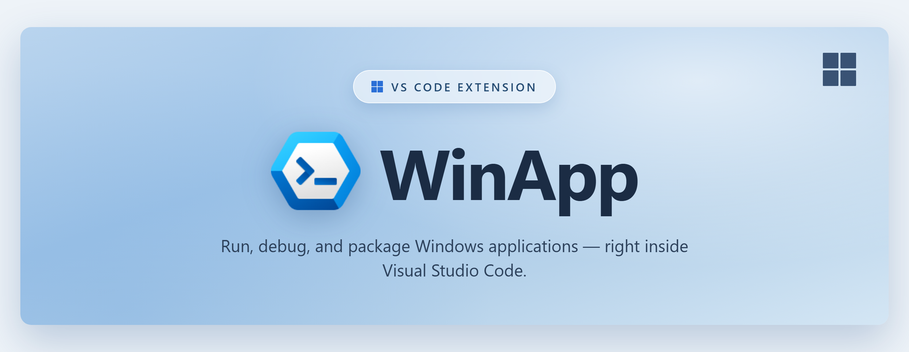

<p align="center">
  
</p>

# WinApp — VS Code Extension

The **WinApp** extension brings the [Windows App Development CLI (WinApp CLI)](https://github.com/microsoft/WinAppCli) into Visual Studio Code so you can initialize, debug, package, and sign Windows applications without leaving the editor.

> **Status: Public Preview** — The WinApp CLI and this extension are experimental and in active development. We'd love your feedback! [File an issue](https://github.com/microsoft/WinAppVSCE/issues).

## Get Started

> The WinApp VS Code Extension is now available in the VS Code Marketplace.

Try the WinApp extension today: [**VS Code Markplace**](https://marketplace.visualstudio.com/items?itemName=Microsoft-WinAppCLI.winapp)

## Features

### Command Palette

All commands are accessible from the Command Palette (`Ctrl+Shift+P`). Type **WinApp** to see the full list.

| Command | Description |
|---------|-------------|
| **WinApp: Initialize Project** | Set up a new project with the Windows SDK and/or Windows App SDK. Prompts for SDK channel (stable, preview, experimental, or none). |
| **WinApp: Restore Packages** | Restore project packages and dependencies. |
| **WinApp: Update Packages** | Update packages and dependencies to the latest versions. |
| **WinApp: Run Application** | Run your app as a loose-layout packaged application with full package identity — great for testing APIs that require identity. |
| **WinApp: Create Debug Identity** | Add sparse package identity to an existing executable so you can launch and debug it directly from VS Code with identity. |
| **WinApp: Unregister Package** | Unregister a sideloaded development package (e.g., one registered via Run or Create Debug Identity). |
| **WinApp: Create MSIX Package** | Package your application into an MSIX, with options to generate a certificate and bundle the runtime self-contained. |
| **WinApp: Generate Manifest** | Generate an `AppxManifest.xml` from a template (packaged or sparse). |
| **WinApp: Add Manifest Execution Alias** | Add an execution alias to the manifest so the packaged app can be launched from the command line. |
| **WinApp: Update Manifest Assets** | Auto-generate all required app icon assets from a single source image (PNG, JPG, GIF, or BMP). |
| **WinApp: Generate Certificate** | Create a development certificate for signing, with an option to install it immediately. |
| **WinApp: Install Certificate** | Install an existing `.pfx` or `.cer` certificate. (requires Admin elevation) |
| **WinApp: Certificate Info** | Display certificate details (subject, thumbprint, expiry) to verify a certificate matches your manifest. |
| **WinApp: Sign Package** | Sign an MSIX package or executable with a certificate. |
| **WinApp: Run SDK Tool** | Run Windows SDK tools (`makeappx`, `signtool`, `mt`, `makepri`) with custom arguments. |
| **WinApp: Get WinApp Path** | Show paths to installed SDK components. |

#### Workspace & Multi-Project Support

The extension supports workspaces where the app project is **not** at the root — such as monorepos, multi-app repositories, or nested project structures.

**How it works:**

When you run any WinApp command, the extension resolves the target project directory using this priority:

1. **`winapp.appDirectories` setting** — If specified in `.vscode/settings.json`, the extension uses these paths directly (no scanning). With one entry, it auto-selects; with multiple, it shows a QuickPick.
2. **Project at workspace root** — If a recognized project exists at the root, commands run there immediately.
3. **Automatic scan** — Searches the workspace for compatible projects and prompts if multiple are found.

**Configuration (optional):**

To skip automatic scanning, add the `winapp.appDirectories` setting to your workspace:

```jsonc
// .vscode/settings.json
{
  "winapp.appDirectories": [
    "apps/my-app",
    "apps/shell"
  ]
}
```

| Scenario | Behavior |
|----------|----------|
| Setting has 1 entry | All commands auto-target that directory |
| Setting has multiple entries | QuickPick prompt to choose which project |
| Setting is absent or empty | Falls back to auto-detection (see below) |

**Auto-detection behavior (when setting is not configured):**

| Scenario | Behavior |
|----------|----------|
| Project at workspace root | Command runs directly — no prompt |
| No project at root, 1 project found elsewhere | Auto-selects that project |
| No project at root, multiple projects found | Shows a QuickPick list to choose which project to target |
| No projects found anywhere | Falls back to workspace root (the CLI will report an error if initialization is required) |

**Supported project types:** .NET (WPF, WinForms, WinUI 3, Console), Electron, Tauri, Flutter, Rust, and C++ (CMake).

The **WinApp: Initialize Project** command has additional behavior: when no project is at the root, it searches and lets you pick which project to initialize. If no projects are found at all, it offers to initialize in the current directory anyway.

> **Note:** If more than 10 projects are discovered, the search stops and the QuickPick indicates that the list may be incomplete.

### Integrated Debugging

The extension provides a **custom `winapp` debug type** that launches your app with package identity and automatically attaches the appropriate debugger — all from a single **F5** press.

**How it works:**

1. You press **F5** (or start a debug session).
2. The extension locates your build output directories (by scanning for `.exe` files) and optionally uses a manifest specified via `manifest` in `launch.json` or auto-detected by the CLI.
3. You'll then have the option to select the build directory you'd like to run.
4. It launches your app via `winapp run` to give it package identity.
5. A child debug session attaches to the running process using the debugger you specified.

> The `winapp` debug type assumes your project has already been built and that a build output folder containing an `.exe` exists in your project. It **does not** build your project automatically — so after making code changes, you must rebuild your project before launching to see those changes reflected in the running app.

> You can automate the build step by adding a `preLaunchTask` to your `launch.json` configuration. This tells VS Code to run a build task before every debug session, so your changes are always compiled before launch.
>
> 1. Define a build task in `.vscode/tasks.json` (example for .NET):
>    ```jsonc
>    {
>        "version": "2.0.0",
>        "tasks": [
>            {
>                "label": "build",
>                "command": "dotnet",
>                "type": "process",
>                "args": ["build", "${workspaceFolder}"],
>                "problemMatcher": "$msCompile"
>            }
>        ]
>    }
>    ```
> 2. Reference it in your `launch.json`:
>    ```jsonc
>    {
>        "type": "winapp",
>        "request": "launch",
>        "name": "WinApp: Launch and Attach",
>        "preLaunchTask": "build"
>    }
>    ```

**Supported debuggers:**

| `debuggerType` | Language | Required Extension |
|----------------|----------|--------------------|
| `coreclr` (default) | C# / .NET | [C# Dev Kit](https://marketplace.visualstudio.com/items?itemName=ms-dotnettools.csharp) |
| `cppvsdbg` | C / C++ | [C/C++](https://marketplace.visualstudio.com/items?itemName=ms-vscode.cpptools) |
| `node` | Node.js / Electron | Built-in |

**Example `launch.json`:**

```jsonc
{
    "version": "0.2.0",
    "configurations": [
        {
            "type": "winapp",
            "request": "launch",
            "name": "WinApp: Launch and Attach",
        }
    ]
}
```

**Configuration properties:**

| Property | Type | Default | Description |
|----------|------|---------|-------------|
| `inputFolder` | string | | Path to the build output folder containing your app binaries (e.g., `${workspaceFolder}/bin/Debug/net8.0-windows10.0.22621`). If not set, you will be prompted to select a folder. |
| `manifest` | string | | Path to the `AppxManifest.xml` file. If not set, the CLI auto-detects from the input folder or current directory. |
| `debuggerType` | string | `coreclr` | Underlying debugger to use (`coreclr`, `cppvsdbg`, or `node`). |
| `workingDirectory` | string | workspace folder | Working directory for the application. |
| `args` | string | | Command-line arguments to pass to the application. |
| `outputAppxDirectory` | string | | Output directory for the loose-layout package. Defaults to an `AppX` folder inside the input folder. |

### AppxManifest Visual Editor

The extension includes a **visual editor** for `AppxManifest.xml` and `.appxmanifest` files. Instead of hand-editing XML, you get a form-based UI organized into tabs:

| Tab | What you can edit |
|-----|-------------------|
| **Identity** | Package name, publisher, version, processor architecture, phone identity (optional), and resource ID |
| **Properties** | Display name, publisher display name, description, and store logo path |
| **Dependencies** | Target device families (min/max versions), package dependencies, main package dependencies, driver constraints, OS package dependencies, host runtime dependencies, and external dependencies |
| **Resources** | BCP-47 language declarations (e.g. `en-us`, `fr-fr`) |
| **Capabilities** | General, restricted, device, and custom capabilities (e.g. Internet Client, Run Full Trust, Microphone) |
| **Applications** | Application entries including executable path, entry point, trust level, runtime behavior, visual elements (logos, splash screen, tile options), and extensions (protocol activation, COM servers, background tasks, file type associations, app services, and more) |

**Key features:**

- **Real-time validation** — inline errors for required fields, format rules (publisher DN, version, GUIDs, BCP-47, hex colors), and extension field requirements
- **Asset generation** — "Regenerate Assets" button invokes the CLI to auto-generate all icon sizes from a single source image
- **Extension management** — add/remove typed extensions (Protocol Activation, COM Server, Background Tasks, File Type Association, App Execution Alias, Startup Task, Share Target, App Service, Toast Notification Activation, MCP Server) with pre-filled templates
- **Reorderable lists** — drag dependencies and resources up/down to control XML element order
- **Format-preserving edits** — changes are applied surgically to the XML text, preserving your whitespace, comments, and attribute ordering

**How to open:**

When you open an `AppxManifest.xml` or `.appxmanifest` file, VS Code will offer the visual editor as an option alongside the default text editor. You can switch between them at any time by right clicking on the file and selecting the **Open With…** command.

## Scenarios

### Initialize and set up a project

Run **WinApp: Initialize Project** to configure your project with the Windows SDK and/or Windows App SDK. The command:

1. **Detects your project** — If there's a recognized app project at the workspace root, it proceeds immediately. Otherwise, it searches the workspace and presents a list of discovered projects for you to choose from.
2. **Asks for SDK channel** — Select stable, preview, experimental, or none (for projects like Rust/Tauri that bring their own SDK bindings).
3. **Runs `winapp init`** — Sets up the manifest, SDK packages, and configuration for the selected project.

### Debug with package identity

Many Windows APIs — notifications, background tasks, on-device AI, share targets — require your app to have **package identity**. The WinApp debug type gives your app identity automatically when you press F5, so you can test these APIs during development without building a full MSIX installer.

For scenarios where you need to debug startup code from the very first instruction, use **WinApp: Create Debug Identity** to register a sparse package for your executable, then launch it normally with your preferred debugger.

When you're done testing, use **WinApp: Unregister Package** to clean up sideloaded packages without leaving VS Code.

### Generate manifests and assets

Use **WinApp: Generate Manifest** to create an `Package.appxmanifest` from a template, then **WinApp: Update Manifest Assets** to auto-generate all required app icons from a single source image. Use **WinApp: Add Manifest Execution Alias** to add a command-line alias so your packaged app can be launched by typing its name in a terminal.

### Package and sign

Use **WinApp: Create MSIX Package** to package your application. Pair it with **WinApp: Generate Certificate** and **WinApp: Sign Package** to produce a signed, ready-to-distribute MSIX. Use **WinApp: Certificate Info** to verify a certificate's details (subject, thumbprint, expiry) before signing.

### Access Windows SDK tools

**WinApp: Run SDK Tool** gives you direct access to `makeappx`, `signtool`, `mt`, and `makepri` — no need to find SDK installation paths or open a separate Developer Command Prompt.

## Supported Frameworks

The winapp CLI (and this extension) works with any Windows app framework:

- **.NET** — WPF, WinForms, Console, WinUI 3
- **C / C++** — Win32, CMake, MSBuild
- **Electron** / **Node.js**
- **Rust**
- **Tauri**
- **Flutter**

## Requirements

- Windows 10 or later
- Visual Studio Code 1.109.0 or later

The winapp CLI is bundled with the extension — no separate installation required.

For debugging, install the debugger extension that matches your app's language (see [Supported debuggers](#integrated-debugging) above).

## Troubleshooting

| Problem | Cause | Solution |
|---------|-------|----------|
| **"No folders containing .exe files found in the workspace..."** or **"No build output folder selected..."** when pressing F5 | The project hasn't been built yet, or the build output is in an unexpected location. | Build your project first (e.g., `dotnet build`), or set `inputFolder` in `launch.json` to point to the folder containing your `.exe`. |
| **Debugger doesn't attach** | The required debugger extension isn't installed. | Install the matching extension for your language — see [Supported debuggers](#integrated-debugging). |
| **App launches but changes aren't visible** | The `winapp` debug type does not build the project automatically. | Rebuild your project before pressing F5, or add a `preLaunchTask` to automate it (see the tip in [Integrated Debugging](#integrated-debugging)). |
| **Certificate trust error when running** | The development certificate isn't installed or has expired. | Run **WinApp: Generate Certificate** and choose to install it, or run **WinApp: Install Certificate** with your existing `.pfx` file. (requires Admin elevation) |
| **"Access denied" or permission errors** | Some operations (certificate install, package registration) require elevation. | Run VS Code as Administrator, or use an elevated terminal for the failing command. |

## Feedback and Support

- [File an issue or feature request](https://github.com/microsoft/WinAppVSCE/issues)
- [Support Guide](https://github.com/microsoft/WinAppVSCE/blob/main/SUPPORT.md)
