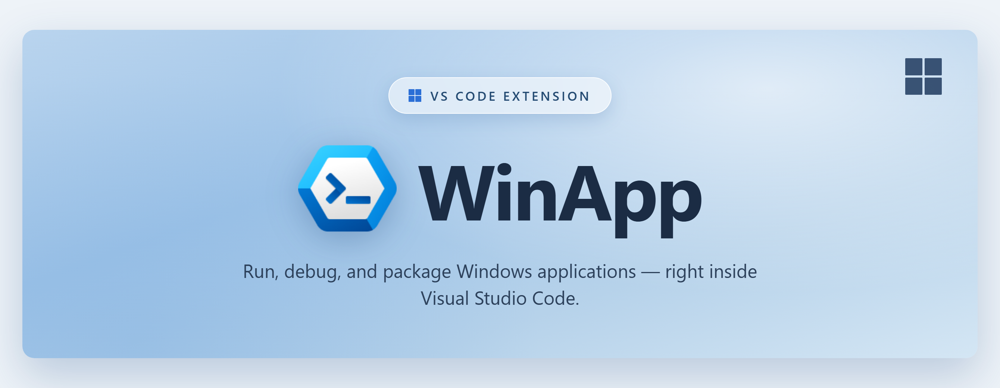

<p align="center">
  
</p>

# WinApp — VS Code Extension

The **WinApp** extension brings the [Windows App Development CLI (WinApp CLI)](https://github.com/microsoft/WinAppCli) into Visual Studio Code so you can initialize, debug, package, and sign Windows applications without leaving the editor.

> **Status: Public Preview** — The WinApp CLI and this extension are experimental and in active development. We'd love your feedback! [File an issue](https://github.com/microsoft/WinAppVSCE/issues).

## Get Started

> The WinApp VS Code Extension is now available in the VS Code Marketplace.

Try the WinApp extension today: [**VS Code Markplace**](https://marketplace.visualstudio.com/items?itemName=Microsoft-WinAppCLI.winapp)

## Features

### Command Palette

All commands are accessible from the Command Palette (`Ctrl+Shift+P`). Type **WinApp** to see the full list.

| Command | Description |
|---------|-------------|
| **WinApp: Create WinUI App** | Scaffold a new WinUI 3 app from an official Windows App SDK template. Pick a template, name it, and choose where it goes. Works with no folder open. Requires the .NET SDK. |
| **WinApp: Initialize Project** | Set up a new project with the Windows SDK and/or Windows App SDK. Prompts for SDK channel (stable, preview, experimental, or none). |
| **WinApp: Restore Packages** | Restore project packages and dependencies. |
| **WinApp: Update Packages** | Update packages and dependencies to the latest versions. |
| **WinApp: Run Application** | Build and run your app as a loose-layout packaged application with full package identity, which is great for testing APIs that require identity. Select a project (`.csproj`), a solution (`.sln`/`.slnx`), or an already-built output folder. |
| **WinApp: Run Application With Options...** | Same as **Run Application**, but prompts for the build configuration, target architecture, and options such as cleaning app data, skipping the build, detaching, or unregistering on exit. |
| **WinApp: Create Debug Identity** | Add sparse package identity to an existing executable so you can launch and debug it directly from VS Code with identity. |
| **WinApp: Unregister Package** | Unregister a sideloaded development package (e.g., one registered via Run or Create Debug Identity). |
| **WinApp: Create MSIX Package** | Package your application into an MSIX, with options to generate a certificate and bundle the runtime self-contained. If self-contained packaging appears to target a different architecture than your machine, WinApp shows a warning before continuing. On completion, a notification names the built package and offers **Reveal in Explorer**, **Sign**, and **Install** actions. |
| **WinApp: Generate Manifest** | Generate an `AppxManifest.xml` from a template (packaged or sparse). |
| **WinApp: Add Manifest Execution Alias** | Add an execution alias to the manifest so the packaged app can be launched from the command line. |
| **WinApp: Update Manifest Assets** | Auto-generate all required app icon assets from a single source image (PNG, JPG, GIF, or BMP). |
| **WinApp: Generate Certificate** | Create a development certificate for signing, with an option to also install (trust) it. Installing prompts for admin via a UAC window when VS Code isn't elevated. |
| **WinApp: Install Certificate** | Install (trust) an existing `.pfx` or `.cer` certificate in the machine store. Prompts for admin via a UAC window when VS Code isn't elevated. |
| **WinApp: Certificate Info** | Display certificate details (subject, thumbprint, expiry) to verify a certificate matches your manifest. |
| **WinApp: Open Manifest Editor** | Discover workspace manifests, select one (or **Browse…** for another file), and open it in the AppxManifest Editor. |
| **WinApp: Sign File** | Sign an MSIX/APPX package, executable, or library with a certificate. |
| **WinApp: Run SDK Tool** | Run Windows SDK tools (`makeappx`, `signtool`, `mt`, `makepri`) with custom arguments. |
| **WinApp: Get WinApp Path** | Show paths to installed SDK components. |

#### Workspace & Multi-Project Support

The extension supports workspaces where the app project is **not** at the root — such as monorepos, multi-app repositories, or nested project structures.

**How it works:**

When you run a project-context WinApp command — such as **Initialize Project**, **Restore/Update Packages**, **Generate Manifest**, **Update Manifest Assets**, **Add Manifest Execution Alias**, **Generate Certificate**, **Unregister Package**, or **Get WinApp Path** — the extension resolves the target project directory using this priority:

1. **`winapp.appDirectories` setting** — If specified in `.vscode/settings.json`, the extension uses these paths directly (no scanning). With one entry, it auto-selects; with multiple, it shows a QuickPick.
2. **Project at workspace root** — If a recognized project exists at the root, commands run there immediately.
3. **Automatic scan** — Searches the workspace for compatible projects and prompts if multiple are found.

Commands that already take an explicit target — such as **Create MSIX Package** (input folder), **Sign File** (workspace QuickPick with file-dialog fallback), **Install Certificate**, and **Certificate Info** (file pickers) — operate on the file or folder you select and do not run project detection.

**Run Application and F5** use their own target discovery rather than the project detection above. They auto-discover runnable `.csproj` and `.sln` files for .NET apps and prompt only if several are found. If none is found, they fall back to discovering build output folders. You can always pick something that wasn't listed with **Browse…**, which then asks whether you want a project or solution file or a build output folder. Running a build output folder needs a `Package.appxmanifest` (or `AppxManifest.xml`) in it. Run **WinApp: Generate Manifest** if you don't have one.

**Configuration (optional):**

To skip automatic scanning, add the `winapp.appDirectories` setting to your workspace:

```jsonc
// .vscode/settings.json
{
  "winapp.appDirectories": [
    "apps/my-app",
    "apps/shell"
  ]
}
```

| Scenario | Behavior |
|----------|----------|
| Setting has 1 entry | Project-context commands auto-target that directory |
| Setting has multiple entries | QuickPick prompt to choose which project |
| Setting is absent or empty | Falls back to auto-detection (see below) |

**Auto-detection behavior (when setting is not configured):**

| Scenario | Behavior |
|----------|----------|
| Project at workspace root | Command runs directly — no prompt |
| No project at root, 1 project found elsewhere | Auto-selects that project |
| No project at root, multiple projects found | Shows a QuickPick list to choose which project to target |
| No projects found anywhere | Falls back to workspace root (the CLI will report an error if initialization is required) |

**Supported project types:** .NET (WPF, WinForms, WinUI 3, Console), Electron, Tauri, Flutter, Rust, and C++ (CMake).

The **WinApp: Initialize Project** command has additional behavior: when no project is at the root, it searches and lets you pick which project to initialize. If no projects are found at all, it offers to initialize in the current directory anyway.

> **Note:** If more than 10 projects are discovered, the search stops and the QuickPick indicates that the list may be incomplete.

### Integrated Debugging

The extension provides a **custom `winapp` debug type** that launches your app with package identity and automatically attaches the appropriate debugger — all from a single **F5** press.

**How it works:**

1. You press **F5** (or start a debug session).
2. The extension resolves what to run from `input` in `launch.json`. If `input` isn't set, it searches every workspace folder for projects and solutions, falling back to scanning for build output folders, and prompts you to pick one.
3. If the target is a project or solution, WinApp restores and builds it first. If it's a build output folder, WinApp launches it as-is.
4. It launches your app via `winapp run` to give it package identity, using the manifest specified via `manifest` in `launch.json` or auto-detected by the CLI.
5. A child debug session attaches to the running process using the debugger you specified.

> **Point `input` at a project to get builds for free.** When `input` is a `.csproj`, `.sln`, or `.slnx`, `winapp run` restores and builds before launching, so your code changes are always reflected. When `input` is a build output folder, WinApp **does not** build; you must rebuild yourself (or use a `preLaunchTask`) after making code changes.

> When `input` is a build output folder, you can automate the build step by adding a `preLaunchTask` to your `launch.json` configuration. This tells VS Code to run a build task before every debug session, so your changes are always compiled before launch. Apps without a project file, such as Electron, Rust, and C++ apps, always run this way, so a `preLaunchTask` is the way to keep their builds current.
>
> 1. Define a build task in `.vscode/tasks.json`. Any build command works; this example uses .NET, but `npm run build`, `cargo build`, or an MSBuild invocation work the same way:
>    ```jsonc
>    {
>        "version": "2.0.0",
>        "tasks": [
>            {
>                "label": "build",
>                "command": "dotnet",
>                "type": "process",
>                "args": ["build", "${workspaceFolder}"],
>                "problemMatcher": "$msCompile"
>            }
>        ]
>    }
>    ```
> 2. Reference it in your `launch.json`:
>    ```jsonc
>    {
>        "type": "winapp",
>        "request": "launch",
>        "name": "WinApp: Launch and Attach",
>        "preLaunchTask": "build"
>    }
>    ```

**Supported debuggers:**

| `debuggerType` | Language | Required Extension |
|----------------|----------|--------------------|
| `coreclr` | C# / .NET | [C#](https://marketplace.visualstudio.com/items?itemName=ms-dotnettools.csharp) |
| `cppvsdbg` | C / C++ | [C/C++](https://marketplace.visualstudio.com/items?itemName=ms-vscode.cpptools) |
| `node` | Node.js / Electron | Built-in |

> On your first debug session, if the extension for the selected `debuggerType` isn't installed, WinApp offers to install it and continues the session automatically — no manual reload needed in most cases. If no `debuggerType` is set and none is installed yet, WinApp lets you pick the debugger that matches your project (C#, C/C++, or built-in Node.js/Electron).

**Example `launch.json`:**

```jsonc
{
    "version": "0.2.0",
    "configurations": [
        {
            "type": "winapp",
            "request": "launch",
            "name": "WinApp: Launch and Attach",
        }
    ]
}
```

**Configuration properties:**

`input` accepts either a **project or solution** (project mode: WinApp restores, builds, and then launches) or a **build output folder** (folder mode: WinApp launches what is already built). Properties marked *project mode only* are ignored when `input` is a build output folder.

| Property | Type | Default | Description |
|----------|------|---------|-------------|
| `input` | string | | What to run: a project (`.csproj`), a solution (`.sln`/`.slnx`), a directory containing one, or a build output folder (e.g., `${workspaceFolder}/bin/Debug/net8.0-windows10.0.22621`). If not set, you will be prompted to select a target. |
| `inputFolder` | string | | **Deprecated.** Use `input`, which also accepts projects and solutions. Still honored for existing configurations; if both are set, `input` wins. |
| `project` | string | | *Project mode only.* Selects which project to launch, by name or path, when `input` is a solution or a directory containing more than one runnable app project. |
| `configuration` | string | `Debug` | *Project mode only.* Build configuration to use. |
| `arch` | string | current process arch | *Project mode only.* Target architecture (`x64`, `arm64`, or `x86`). Ignored when `runtime` is set. |
| `framework` | string | | *Project mode only.* Target framework moniker to build, for multi-targeted projects (e.g., `net8.0-windows10.0.19041.0`). |
| `runtime` | string | | *Project mode only.* Runtime identifier to build for (e.g., `win-x64`). Overrides `arch`. Only Windows RIDs are supported. |
| `properties` | object | | *Project mode only.* MSBuild properties to pass to the build, as name/value pairs. |
| `noBuild` | boolean | `false` | *Project mode only.* Run the existing build output without rebuilding. |
| `noRestore` | boolean | `false` | *Project mode only.* Do not restore the project before building. Has no effect alongside `noBuild`. |
| `aot` | boolean | `false` | *Project mode only.* Run the project's configured .NET Native AOT publish instead of an ordinary build. Requires an effective `PublishAot=true`. |
| `clean` | boolean | `false` | Remove the existing package's application data (LocalState and settings) before deploying. |
| `unregisterOnExit` | boolean | `false` | Remove the development package registration after the application exits. |
| `withAlias` | boolean | `false` | Launch through the package's execution alias so stdin/stdout are inherited. Console apps (`OutputType=Exe`) already do this; set it to force the same for a windowed app. Cannot be combined with `withoutAlias`. |
| `withoutAlias` | boolean | `false` | Launch through AUMID activation even for a console app, which would otherwise use its execution alias. The app then runs without a console. Cannot be combined with `withAlias`. |
| `executable` | string | auto-detect | *Folder mode only.* Which executable to launch, relative to the input folder, when the manifest uses a `$targetnametoken$` placeholder and the folder holds more than one `.exe`. |
| `manifest` | string | auto-detect | Path to the package manifest. The CLI locates an existing `Package.appxmanifest` or `AppxManifest.xml` in the input folder or current directory; it never generates one. |
| `debuggerType` | string | | Optional underlying debugger override (`coreclr`, `cppvsdbg`, or `node`). If omitted, WinApp reuses an installed debugger or prompts you to pick one. |
| `workingDirectory` | string | workspace folder | Working directory for the application. |
| `args` | string | | Command-line arguments to pass to the application. |
| `outputAppxDirectory` | string | | Output directory for the loose-layout package. Defaults to an `AppX` folder inside the input folder. |

> The `--detach` and `--no-launch` CLI options are deliberately not available in `launch.json`: both leave no running process for the debugger to attach to. Use **WinApp: Run Application With Options...** if you need them. The same applies to `--debug-output` and `--symbols` — `--debug-output` attaches the CLI's own debugger, and only one debugger can attach to a process at a time.

**Choosing build settings:**

**Run Application** builds with the CLI's own defaults and prompts only for the target. To change the configuration, architecture, or any of the run toggles, use **WinApp: Run Application With Options...**, which prompts for them per run. For a setting you want applied every time, put it in a `launch.json` configuration and start with F5.

### AppxManifest Visual Editor

The extension includes a **visual editor** for `AppxManifest.xml` and `.appxmanifest` files. Instead of hand-editing XML, you get a form-based UI organized into tabs:

| Tab | What you can edit |
|-----|-------------------|
| **Identity** | Package name, publisher, version, processor architecture, phone identity (optional), and resource ID |
| **Properties** | Display name, publisher display name, description, and store logo path |
| **Dependencies** | Target device families (min/max versions), package dependencies, main package dependencies, driver constraints, OS package dependencies, host runtime dependencies, and external dependencies |
| **Resources** | BCP-47 language declarations (e.g. `en-us`, `fr-fr`) |
| **Capabilities** | General, restricted, device, and custom capabilities (e.g. Internet Client, Run Full Trust, Microphone) |
| **Applications** | Application entries including executable path, entry point, trust level, runtime behavior, visual elements (logos, splash screen, tile options), and extensions (protocol activation, COM servers, background tasks, file type associations, app services, and more) |

**Key features:**

- **Real-time validation** — inline errors for required fields, format rules (publisher DN, version, GUIDs, BCP-47, hex colors), and extension field requirements
- **Asset generation** — "Regenerate Assets" button invokes the CLI to auto-generate all icon sizes from a single source image
- **Extension management** — add/remove typed extensions (Protocol Activation, COM Server, Background Tasks, File Type Association, App Execution Alias, Startup Task, Share Target, App Service, Toast Notification Activation, MCP Server) with pre-filled templates
- **Reorderable lists** — drag dependencies and resources up/down to control XML element order
- **Format-preserving edits** — changes are applied surgically to the XML text, preserving your whitespace, comments, and attribute ordering

**How to open:**

When you open an `AppxManifest.xml` or `.appxmanifest` file, VS Code will offer the visual editor as an option alongside the default text editor. You can switch between them at any time by right clicking on the file and selecting the **Open With…** command.

### AppxManifest IntelliSense

When you edit an `AppxManifest.xml` or `.appxmanifest` file in the text editor, the extension provides schema-aware IntelliSense powered by bundled AppxManifest XSD schemas from the Windows SDK. That means completions, hovers, validation, and navigation are based on the same schema definitions used by Windows manifests.

**What you get:**

- **Element completions** — context-aware child element suggestions for the current XML location
- **Attribute completions** — valid attributes for the current element
- **Attribute value completions** — allowed enum values from XSD restrictions
- **Hover documentation** — element and attribute descriptions from XSD annotations
- **Diagnostics** — errors for missing required attributes/elements, invalid values, and pattern violations; warnings for undeclared attributes
- **Go to Definition** — **F12** / **Ctrl+Click** jumps to the relevant schema definition

**Supported files:**

- `**/[Aa]ppx[Mm]anifest.xml`
- `**/*.appxmanifest`

**Switching between text and visual editors:**

When viewing a manifest in the text editor, click the **preview icon** (📋) in the editor title bar to switch to the visual editor. From the visual editor, click **View XML** to switch back.

**Disabling IntelliSense:**

If you prefer to use the extension's other features (run, pack, sign, etc.) without IntelliSense, you can disable it in your settings:

```jsonc
// .vscode/settings.json or User Settings
{
  "winapp.manifest.intelliSense.enable": false
}
```

You can also disable just the diagnostic underlines while keeping completions and hover:

```jsonc
{
  "winapp.manifest.diagnostics.level": "off"
}
```

**Configuration:**

| Setting | Description |
|---------|-------------|
| `winapp.manifest.intelliSense.enable` | Enable or disable all IntelliSense features (completions, hover, diagnostics, Go to Definition). Default: `true`. |
| `winapp.manifest.diagnostics.level` | Filter manifest diagnostics: `off` disables validation, `warning` shows all diagnostics, and `error` shows only errors. Default: `warning`. |
| `winapp.manifest.intelliSense.diagnostics.strictChildPlacement` | When enabled, report known manifest elements that appear under an unexpected parent even when substitution-group coverage is incomplete. |

## Scenarios

### Create a new WinUI app

Run **WinApp: Create WinUI App** to scaffold a WinUI 3 app from an official Windows App SDK template. The command:

1. **Loads the templates** — Fetches the available WinUI templates, installing the template pack on first run. If a pack is already on your machine, you're asked whether to use it or install the latest (a machine-wide change that affects all `dotnet new` tooling).
2. **Asks for a template** — Choose from the templates the CLI reports, such as the blank app, the MVVM app, or a class library.
3. **Asks for a name and a location** — Pick the folder to create the app in; the project lands in `<folder>/<name>`. If the CLI reports that the directory already has files, you're offered the chance to create there anyway.
4. **Confirms where it landed** — A notification names the new app and its full path.

The [.NET SDK](https://dotnet.microsoft.com/download) 8.0.100 or later is required — this is the only WinApp command that needs it. If it's missing or older than 8.0.100, the command stops before prompting and offers a link to the installer.

### Initialize and set up a project

Run **WinApp: Initialize Project** to configure your project with the Windows SDK and/or Windows App SDK. The command:

1. **Detects your project** — If there's a recognized app project at the workspace root, it proceeds immediately. Otherwise, it searches the workspace and presents a list of discovered projects for you to choose from.
2. **Asks for SDK channel** — Select stable, preview, experimental, or none (for projects like Rust/Tauri that bring their own SDK bindings).
3. **Runs `winapp init`** — Sets up the manifest, SDK packages, and configuration for the selected project.

### Debug with package identity

Many Windows APIs — notifications, background tasks, on-device AI, share targets — require your app to have **package identity**. The WinApp debug type gives your app identity automatically when you press F5, so you can test these APIs during development without building a full MSIX installer.

For scenarios where you need to debug startup code from the very first instruction, use **WinApp: Create Debug Identity** to register a sparse package for your executable, then launch it normally with your preferred debugger.

When you're done testing, use **WinApp: Unregister Package** to clean up sideloaded packages without leaving VS Code.

### Generate manifests and assets

Use **WinApp: Generate Manifest** to create an `Package.appxmanifest` from a template, then **WinApp: Update Manifest Assets** to auto-generate all required app icons from a single source image. Use **WinApp: Add Manifest Execution Alias** to add a command-line alias so your packaged app can be launched by typing its name in a terminal.

### Package and sign

Use **WinApp: Create MSIX Package** to package your application. If you choose **self-contained** packaging and the selected build output path appears to target a different architecture than your machine, WinApp shows a warning before continuing so you can avoid bundling the wrong Windows App SDK runtime. When packaging finishes, a completion notification names the built `.msix` and offers three actions: **Reveal in Explorer** (open the package in File Explorer), **Sign** (sign the just-built package), and **Install** (sideload it via `Add-AppxPackage`). Use **WinApp: Sign File** to sign MSIX/APPX packages, `.exe` files, and `.dll` files with a `.pfx` certificate.

### Access Windows SDK tools

**WinApp: Run SDK Tool** gives you direct access to `makeappx`, `signtool`, `mt`, and `makepri` — no need to find SDK installation paths or open a separate Developer Command Prompt. Arguments are passed directly to the selected tool without shell interpretation; double-quote values that contain spaces.

## Supported Frameworks

The winapp CLI (and this extension) works with any Windows app framework:

- **.NET** — WPF, WinForms, Console, WinUI 3
- **C / C++** — Win32, CMake, MSBuild
- **Electron** / **Node.js**
- **Rust**
- **Tauri**
- **Flutter**

## Requirements

- Windows 10 or later
- Visual Studio Code 1.109.0 or later
- The [.NET SDK](https://dotnet.microsoft.com/download) 8.0.100 or later — only for **WinApp: Create WinUI App**, which delegates scaffolding to `dotnet new`

The winapp CLI is bundled with the extension — no separate installation required.

For debugging, install the debugger extension that matches your app's language (see [Supported debuggers](#integrated-debugging) above).

## Troubleshooting

| Problem | Cause | Solution |
|---------|-------|----------|
| **Invalid `input` notification when pressing F5** | The configured path is missing, or (in folder mode) is not a directory or contains no `.exe`. | Select **Open debug configuration** in the notification to open the relevant debug or launch configuration, then correct `input`. |
| **"No run target selected..."** when pressing F5 | The workspace contains no project or solution and nothing has been built yet, or the build output is in an unexpected location. | Set `input` in `launch.json` to a project file so WinApp builds it for you, or build first (e.g., `dotnet build`) and point `input` at the folder containing your `.exe`. |
| **Debugger doesn't attach** | The required debugger extension isn't installed. | Install the matching extension for your language — see [Supported debuggers](#integrated-debugging). |
| **App launches but changes aren't visible** | `input` points at a build output folder, which WinApp launches as-is without building. | Point `input` at your `.csproj` or `.sln` so WinApp builds before launching, rebuild manually before pressing F5, or add a `preLaunchTask` (see the tip in [Integrated Debugging](#integrated-debugging)). |
| **Certificate trust error when running** | The development certificate isn't installed or has expired. | Run **WinApp: Generate Certificate** and choose to also install it, or run **WinApp: Install Certificate** with your existing `.pfx` file. Both prompt for admin (UAC) when VS Code isn't elevated. |
| **"Access denied" or permission errors** | Some operations (package registration) require elevation. Certificate install now prompts for admin automatically. | Approve the UAC prompt when it appears, or run VS Code as Administrator. |

## Feedback and Support

- [File an issue or feature request](https://github.com/microsoft/WinAppVSCE/issues)
- [Support Guide](https://github.com/microsoft/WinAppVSCE/blob/main/SUPPORT.md)
