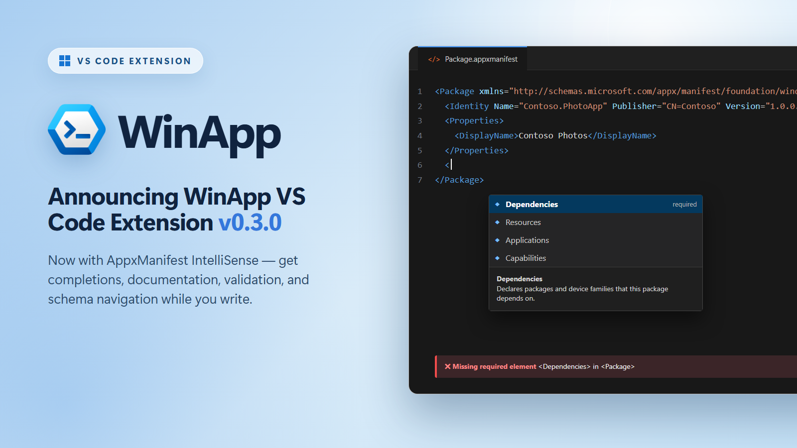

# Announcing AppxManifest IntelliSense Support in the WinApp VS Code Extension



The WinApp VS Code extension exists to make Windows app development feel at home in VS Code. It brings the [Windows App Development CLI](https://github.com/microsoft/WinAppCli) right into the editor, so you can initialize, run, debug, define the identity of, package, and sign Windows apps built with .NET, WPF, WinUI, C++, Electron, Rust, Tauri, or Flutter, all without switching tools.

**Get it now:** Install the [WinApp extension from the VS Code Marketplace](https://marketplace.visualstudio.com/items?itemName=Microsoft-WinAppCLI.winapp).

We're excited to announce the release of v0.3.0. This release brings schema-aware IntelliSense to your manifest files, adds workspace search to the commands that require a file or folder, and includes a bunch of other feature and reliability improvements.

## IntelliSense for AppxManifest

Your `AppxManifest.xml` (or `.appxmanifest`) declares your app's identity, capabilities, dependencies, and activation. In v0.2 we shipped a [visual editor](https://devblogs.microsoft.com/ifdef-windows/announcing-a-new-visual-manifest-editor-in-the-winapp-vs-code-extension/), a user-friendly form for editing and validating manifest files.

With v0.3.0, we're introducing support for AppxManifest IntelliSense in VS Code. The extension bundles the AppxManifest XSD schemas from the Windows SDK and parses your manifest as you type, offering autocomplete suggestions and flagging errors the moment the manifest becomes invalid. AppxManifest IntelliSense in the WinApp extension supports:

- **Element autocompletion**: IntelliSense suggests valid elements such as `Identity` or `uap:VisualElements` based on your cursor position and the contents of your manifest
- **Attribute autocompletion**: IntelliSense suggests the attributes the current element supports, sorting required attributes to the top and hiding ones you've already set
- **Value autocompletion**: IntelliSense suggests the allowed values for attributes that accept a fixed set
- **Hover documentation**: IntelliSense shows the schema's own description of an element or attribute, along with its type, whether it's required, and what it accepts
- **Diagnostics**: IntelliSense reports missing required elements and attributes, invalid values, format and length violations, misplaced elements, and malformed XML inline as you edit
- **Go to Definition**: IntelliSense resolves any element to its schema definition, reachable with **F12** or **Ctrl+Click**

<TODO add photo>

The text editor and the visual editor now share the same schema model and validation rules. Moving between them is a single click, too: open a manifest in the text editor and you'll find a new button in the upper-right corner of the editor title bar that opens it in the WinApp visual manifest editor.

<TODO add photo>

**Getting started** is nothing more than opening any `AppxManifest.xml` or `.appxmanifest` in the VS Code text editor. IntelliSense is on by default when the WinApp extension is installed.

For more information about manifest IntelliSense, visit the [AppxManifest IntelliSense documentation](https://github.com/microsoft/WinAppVSCE#appxmanifest-intellisense).

## Less File Hunting

WinApp commands that need a file or folder used to open a native file dialog straight away, leaving you to navigate to your build output, package, or certificate by hand.

In v0.3.0, those commands search your workspace first and present matching candidates in a Quick Pick:

| Command | What appears in the Quick Pick |
| --- | --- |
| **WinApp: Create MSIX Package** | Lists build output folders containing an `.exe` |
| **WinApp: Run Application** | Lists build output folders containing an `.exe` |
| **WinApp: Sign File** | Lists MSIX/APPX packages, `.exe`, and `.dll` files, then the `.pfx` certificates to sign them with |

If the file or folder you're after isn't listed, every Quick Pick ends with a **Browse…** option that opens the familiar file dialog.

<TODO add photo>

For more information about the WinApp commands, visit the [Command Palette documentation](https://github.com/microsoft/WinAppVSCE#command-palette).

## More Improvements in v0.3.0

### New Commands

- **WinApp: Open Manifest Editor** is now available from the Command Palette. Select a manifest in your workspace to open it in the manifest visual editor.
- **WinApp: Sign Package** is now **WinApp: Sign File**, reflecting that it signs `.exe` and `.dll` files as well as packages.

### User Experience

- **WinApp: Create MSIX Package** now reports back when it finishes. A notification names the package that was produced and offers **Reveal in Explorer**, **Sign** (which starts the signing flow with the package already filled in), and **Install** (which sideloads it with `Add-AppxPackage`).
- Packaging a self-contained app compares the architecture of your build output against your machine's. If they don't match, a warning now appears with the option to continue anyway.
- Pressing **F5** now checks whether the debugger extension your project needs is installed. If it isn't, a prompt names the missing extension and offers to install it before continuing the session.
- File and folder searches in the pack, run, and sign commands run behind a cancellable progress notification.
- Installing a certificate no longer fails with "access denied" when VS Code isn't running as administrator. Trusting a certificate in the machine store requires elevation, which is now requested with a UAC prompt.

### Reliability

- Fixed the WinApp debug adapter handshake during F5 sessions.
- The `winapp run` process is no longer left running in the background when a debug session fails to start or tears down unexpectedly.
- A relative `workingDirectory` in `launch.json` now resolves against your workspace folder instead of the extension host's working directory.
- An `inputFolder` configured in `launch.json` is validated before launch. If it's missing, isn't a directory, or contains no `.exe`, you get a clear error rather than an unexplained fallback to a folder picker.

## Get Started

The **WinApp VS Code extension** is available in public preview on the [Visual Studio Code Marketplace](https://marketplace.visualstudio.com/items?itemName=Microsoft-WinAppCLI.winapp).

**Install from VS Code:**

1. Open VS Code
2. Go to the Extensions view (`Ctrl+Shift+X`)
3. Search for **WinApp**
4. Click **Install**

Or from the command line:

```
code --install-extension Microsoft-WinAppCLI.winapp
```

**Requirements:**

- Windows 10 or later
- Visual Studio Code 1.109.0 or later
- For debugging, the debugger extension matching your app's language (C#, C/C++, or built-in Node.js)

## We Want Your Feedback

This is still a **public preview**, and your feedback directly shapes what we build next. Whether IntelliSense is missing a manifest scenario you rely on, a command didn't surface the file you expected, or you have an idea to make the workflow smoother, we want to hear it.

- 🐛 [File a bug](https://github.com/microsoft/WinAppVSCE/issues)
- 💡 [Open a feature request](https://github.com/microsoft/WinAppVSCE/issues)
- 👀 Browse [open extension issues](https://github.com/microsoft/WinAppVSCE/issues) to upvote and comment on what matters to you

Happy coding!
