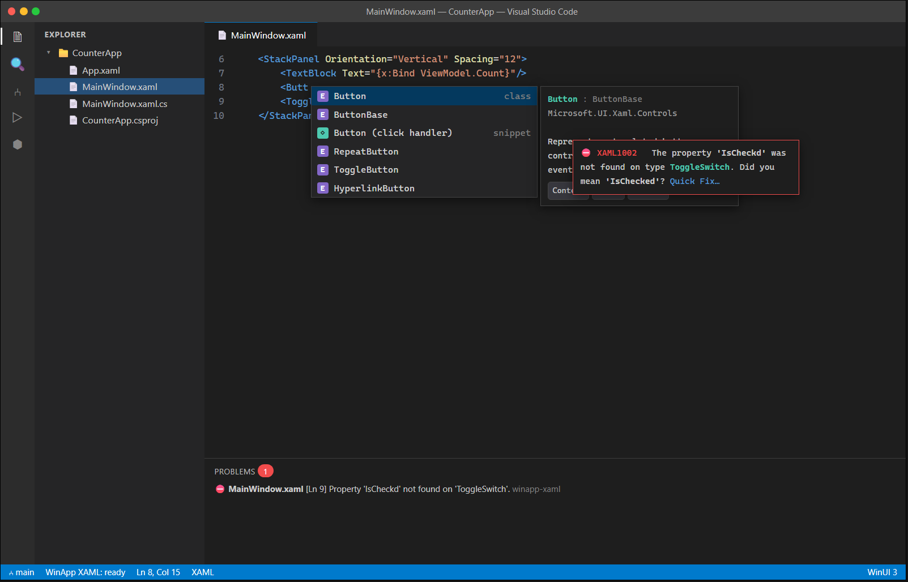

# C1 — XAML Language Server

| | |
|---|---|
| **Spec ID** | C1 |
| **Roadmap area** | C (editor delivery surface) |
| **Depends on** | B (winui CLI), B4 (shared design-time engine — for type/metadata resolution) |
| **Status** | Draft for discussion |
| **Estimated effort** | **16–26 engineer-weeks** (LSP core + WinUI provider); see [Effort](#effort--phasing) |

---

## 1. Summary

Ship a **XAML language server** that gives WinUI 3 (and, where feasible, WPF / UWP / Uno) XAML files
first-class editor intelligence inside VS Code and its AI-native forks (Cursor, Windsurf): element and
attribute completion, value completion (enums, brushes, `StaticResource`/`ThemeResource` keys, event
handlers), hover docs, go-to-definition, find-all-references across XAML↔C#, diagnostics with quick
fixes, and formatting. It is delivered as a Language Server Protocol (LSP) server bundled with the
WinApp extension so it works identically across all LSP-capable editors.



## 2. Problem / motivation

Today, editing WinUI/WPF XAML in VS Code is **colorization only** — there is no first-party XAML IntelliSense outside Visual Studio (Windows-only). A Windows engineer who lives in VS Code (or Cursor / Windsurf) hand-types control names, guesses attribute names, and only discovers typos at build time. This is a big editor-parity gap between VS Code and Visual Studio for Windows app developers.

## 3. Similar Products

| Tool | Approach | Gap we address |
|------|----------|----------------|
| **Visual Studio** (WPF/WinUI/UWP) | Rich native XAML IntelliSense via the in-proc XAML Language Service; Windows + VS only. | We bring comparable intelligence to VS Code / Cursor / Windsurf, cross-editor. |
| **Avalonia for VS Code** | Ships a dedicated Avalonia XAML LSP (project-aware completion, diagnostics, go-to-def). | Proves the LSP model works well in VS Code; we target **WinUI/WinRT** metadata rather than Avalonia's. |
| **Uno Platform for VS Code** | Roslyn-based XAML language server for Uno's XAML dialect. | Similar architecture |
| **Marketplace "XAML" extensions** | Grammar/syntax highlighting only. | We add semantic completion, diagnostics, navigation. |

## 4. Goals / non-goals

**Goals**
- Element, attribute (property/event), and attribute-value completion for WinUI 3 controls.
- Namespace-aware completion (`xmlns` prefixes, `using:` / `clr-namespace:`; custom controls).
- Resource key completion (`{StaticResource}`, `{ThemeResource}`, `{x:Bind}` path hints).
- Hover docs (type/member summary + namespace + inheritance) and signature-style info for markup extensions.
- Diagnostics: unknown type/property, wrong value type, duplicate `x:Name`, unresolved resource key,
  unresolved event handler — each with a quick fix where obvious (spelling suggestions, add handler stub).
- Go-to-definition / find-references bridging XAML `x:Name`, event handlers, and `{x:Bind}` paths to C#.
- Document + selection formatting.
- Works in VS Code, Cursor, Windsurf (pure LSP, no VS Code-only APIs in the server).

**Non-goals (this spec)**
- Visual rendering / preview (that is **C3**) and interactive design (**C4**).
- Full binding-expression type-checking parity with the WinUI XAML compiler (best-effort only).
- VB, C++/WinRT `.idl`, or RESW localization intelligence.

## 5. Proposed implementation

**Architecture:** a standalone **language server** process + a thin VS Code client.

```
VS Code / Cursor / Windsurf  ──LSP──▶  WinApp XAML Language Server
   (vscode-languageclient)                 │
                                           ├─ XAML parser (tolerant, incremental)
                                           ├─ Type/metadata provider  ◀── B4 design-time engine
                                           │     (WinMD + project references + custom controls)
                                           ├─ Project model  ◀── winapp CLI (B): csproj/RID/refs
                                           └─ Providers: completion, hover, diagnostics,
                                                 definition, references, formatting
```

- **Language:** the server should be a **.NET** process (C#), because the authoritative WinUI/WinRT type
  metadata and the B4 design-time engine are .NET; this lets us reuse Roslyn (for the C# side of
  go-to-def/`x:Bind`) and WinMD readers directly. (Alternative: TypeScript server calling a .NET
  metadata sidecar — rejected as more moving parts.)
- **Parser:** a fault-tolerant, incremental XML/XAML parser (recover on partial input mid-typing).
- **Type resolution:** resolve `xmlns` → assemblies → types via WinMD + the project's compiled/reference
  assemblies. Reuse **B4**'s type system so the server, visualiser (C3), and designer (C4) agree on one
  model. Cache per-project; invalidate on build/reference change.
- **Project awareness:** ask the winapp CLI (B) for the active project's TFM, RID, and reference set (the
  same resolution the extension already does for build/run). Degrade gracefully to a bundled WinUI
  metadata snapshot when the project isn't restored.
- **Client:** register with `documentSelector` for `xml`/`xaml` scoped to WinUI/WinApp projects; contribute
  a `xaml` language id + TextMate grammar if not already present.

## 6. API / contribution surface

**`package.json` contributions**
```jsonc
"contributes": {
  "languages": [{ "id": "xaml", "extensions": [".xaml"], "aliases": ["XAML"],
                  "configuration": "./xaml-language-configuration.json" }],
  "grammars": [{ "language": "xaml", "scopeName": "text.xml.xaml",
                 "path": "./syntaxes/xaml.tmLanguage.json" }],
  "configuration": {
    "winapp.xaml.languageServer.enable": { "type": "boolean", "default": true },
    "winapp.xaml.diagnostics.level": { "enum": ["off","warning","error"], "default": "warning" },
    "winapp.xaml.completion.includeCustomControls": { "type": "boolean", "default": true },
    "winapp.xaml.trace.server": { "enum": ["off","messages","verbose"], "default": "off" }
  }
}
```

**Commands:** `winapp.xaml.restartLanguageServer`, `winapp.xaml.reloadMetadata`.

**LSP capabilities advertised:** `completionProvider` (trigger chars `<`, space, `.`, `"`, `{`),
`hoverProvider`, `definitionProvider`, `referencesProvider`, `documentFormattingProvider`,
`documentRangeFormattingProvider`, `codeActionProvider` (quick fixes), `diagnostics` (push).

## 7. Design tradeoffs & alternatives

- **.NET server vs Node server.** .NET wins on metadata/Roslyn reuse and B4 sharing; costs a bundled .NET
  runtime (mitigated: the extension already ships/downloads the winapp CLI, a .NET app).
- **Precision vs latency for `{x:Bind}`/binding type-checking.** Full compiler-grade checking needs a
  Roslyn compilation of the code-behind and generated `x:Bind` code — expensive. Start with
  name/path resolution (does the property exist on the DataContext type?) and defer full type-flow checks.
- **Bundled metadata snapshot vs project-restored metadata.** Snapshot gives instant value with zero
  setup but can drift from the project's SDK version; project-restored is accurate but needs a restore.
  Ship both: snapshot as fallback, project metadata when available.

## 8. What will / won't be supported

| Supported (v1) | Not in v1 |
|---|---|
| WinUI 3 controls (WinMD + project refs) | WPF / UWP / Uno dialects (pluggable later) |
| Custom/user controls in the project | Third-party control vendor docs beyond XML summaries |
| Enum/brush/resource-key/event completion | Full `{x:Bind}` compiler-parity type-checking |
| Diagnostics + spelling/handler quick fixes | Rename refactor across XAML↔C# (fast-follow) |
| Hover, go-to-def, find-refs, formatting | `.resw` / MRT resource intelligence |

## 9. Dependencies & risks

- **B4 type system** is the ideal metadata source; if B4 slips, v1 can stand up its own WinMD reader (more
  duplicate work, higher long-term maintenance).
- **WinMD/reference resolution** for un-restored or exotic projects is the main accuracy risk.
- **Cursor/Windsurf parity:** keep all logic in the LSP server; avoid VS Code-proprietary client APIs.

## 10. Open questions

1. Do we reuse the Visual Studio XAML Language Service internals, or build fresh on Roslyn + WinMD?
   (Licensing / componentization question for the VS team.)
2. Is B4 committed to exposing a public type-resolution API the LSP can consume, and on what timeline?
3. How much `{x:Bind}` checking is "enough" for v1 to feel credible vs. VS?
4. Do we own the XAML TextMate grammar, or depend on an existing community grammar?
5. Cross-platform ambition: is WPF/Uno support a committed follow-up or merely "designed for"?