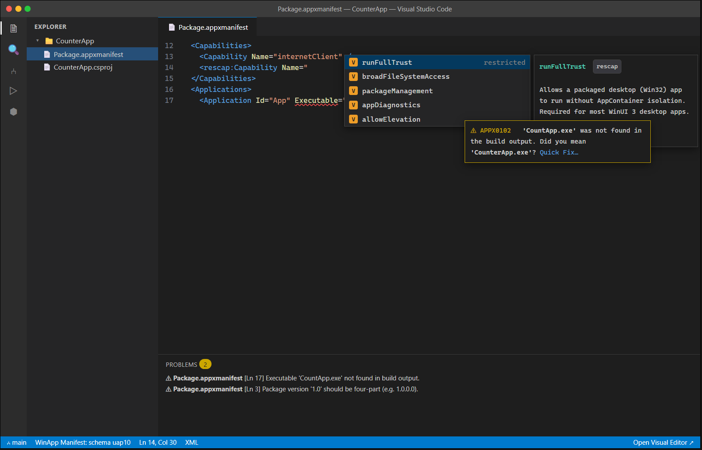

# C2 — AppxManifest IntelliSense

| | |
|---|---|
| **Spec ID** | C2 |
| **Roadmap area** | C (editor delivery surface) |
| **Depends on** | B (winui CLI, for build-output/validation context); existing WinApp manifest visual editor |
| **Status** | Draft for discussion |
| **Estimated effort** | **5–9 engineer-weeks**; see [Effort](#effort--phasing) |

---

## 1. Summary

Provide **schema-driven IntelliSense and validation for `AppxManifest.xml` / `*.appxmanifest`** in the
text editor: element and attribute completion driven by the MSIX manifest schemas (foundation, uap,
uap2–uap10, rescap, desktop, com, …), namespace-prefix awareness, enumerated-value completion,
hover documentation, and semantic diagnostics that go beyond raw XSD (e.g. "the `Executable` you named
isn't in the build output", "capability requires a namespace you haven't declared"). This complements
the extension's existing **visual** manifest editor with a great **text-editing** experience.



## 2. Problem / motivation

The manifest is central to every packaged Windows app, yet hand-editing it in VS Code is unguided XML.
Developers must memorize the sprawling capability list, which `xmlns` prefix a capability needs, exact
enum spellings (`ProcessorArchitecture`, `TrustLevel`, target device families), and four-part version
rules. Mistakes surface late (at pack/deploy) with cryptic errors. The
extension already understands manifests deeply (it ships a **visual editor** with typed extensions and
real-time validation); C2 exposes that intelligence to people editing the XML directly.

## 3. Prior art & competitive analysis

| Tool | Approach | Gap we address |
|------|----------|----------------|
| **Visual Studio** | Manifest **Designer** (form UI) + XSD-backed IntelliSense in the XML view. | We already match the designer (visual editor); C2 adds the XML IntelliSense in VS Code, plus **semantic** checks VS lacks. |
| **VS Code Red Hat XML / built-in XML** | Generic XSD-association gives basic completion if you wire up schemas. | We ship the correct MSIX schemas + prefix mapping out of the box and add manifest-aware semantics. |
| **WinApp visual manifest editor (this extension)** | Form-based editing with validation and templated extensions. | Reuse its validator + schema knowledge as the semantic engine behind text IntelliSense; keep both views in sync. |

**Takeaway:** most of the hard knowledge (schemas, field rules, extension templates) already exists in
the extension's manifest editor. C2 is largely about **surfacing** it in the text editor via LSP-style
providers rather than inventing new domain logic.

## 4. Goals / non-goals

**Goals**
- Completion for elements/attributes valid at the cursor per the manifest schema set and active namespaces.
- Capability completion grouped by kind (general / restricted `rescap` / device / custom), auto-adding the
  required `xmlns` prefix + `IgnorableNamespaces` entry when a namespaced capability is chosen.
- Enum value completion (architecture, trust level, device family, extension categories).
- Hover docs for elements/attributes/capabilities (what it does, which schema, identity implications).
- Semantic diagnostics beyond XSD: unknown/misspelled `Executable` or `EntryPoint` vs build output,
  non-four-part `Version`, missing capability namespace, duplicate `Id`, invalid publisher DN / GUID / BCP-47.
- "Open in Visual Editor" affordance and round-trip consistency with the existing custom editor.

**Non-goals**
- Replacing the visual editor (they coexist; C2 is the text-side companion).
- Validating store-submission policy rules (Partner Center concerns).

## 5. Proposed implementation

Two viable implementations; **recommend (A)** for reuse:

**(A) Extend the existing manifest module with document providers.** The extension already parses,
validates, and understands manifests for its custom editor. Register `CompletionItemProvider`,
`HoverProvider`, and a `DiagnosticCollection` for the `xml` language scoped to manifest filename patterns,
backed by that same schema/validator code. Cheapest path; guarantees the text and visual views share one
source of truth.

**(B) Full LSP server.** Only worth it if we want identical behavior in non-VS Code LSP hosts beyond
Cursor/Windsurf (which already run VS Code extensions). Given manifests are Windows-specific and the
logic is already in-extension, (A) is preferred; keep the provider logic editor-agnostic so it could be
lifted into an LSP later.

## 6. API / contribution surface

```jsonc
"contributes": {
  "configuration": {
    "winapp.manifest.intelliSense.enable": { "type": "boolean", "default": true },
    "winapp.manifest.validate.executableAgainstBuild": { "type": "boolean", "default": true },
    "winapp.manifest.diagnostics.level": { "enum": ["off","warning","error"], "default": "warning" }
  }
}
```
- **Providers:** completion (trigger `<`, space, `"`), hover, code actions (quick fixes: add namespace,
  fix version, correct executable name), diagnostics.
- **Commands:** `winapp.manifest.openVisualEditor` (already exists conceptually via custom editor),
  `winapp.manifest.addCapability` (QuickPick that inserts capability + namespace).

## 7. Design tradeoffs & alternatives

- **Bundled XSD vs generic XML-extension dependency.** Bundling gives zero-config correctness and lets us
  layer semantics; costs us keeping schemas current with new Windows SDK releases (low churn).
- **Warnings vs errors for semantic checks.** Build-output cross-checks can false-positive before a build;
  default them to **warning** and make the level configurable.

## 8. Dependencies & risks

- **Schema currency:** must track Windows SDK manifest schema updates (bundled + refreshable).
- **Two-view sync:** text IntelliSense and the visual editor must agree; mitigated by sharing the validator.
- **Build-output cross-check** depends on B's project/output resolution being reliable.

## 9. Open questions

1. Do we depend on the Red Hat XML extension for base XML services, or keep it self-contained?
2. Should selecting a namespaced capability edit `IgnorableNamespaces` automatically, or only offer a quick fix?
3. How do we surface the relationship to the visual editor (CodeLens? status-bar toggle? both)?
4. Do we validate against the SDK version the project targets, or the newest bundled schema?
