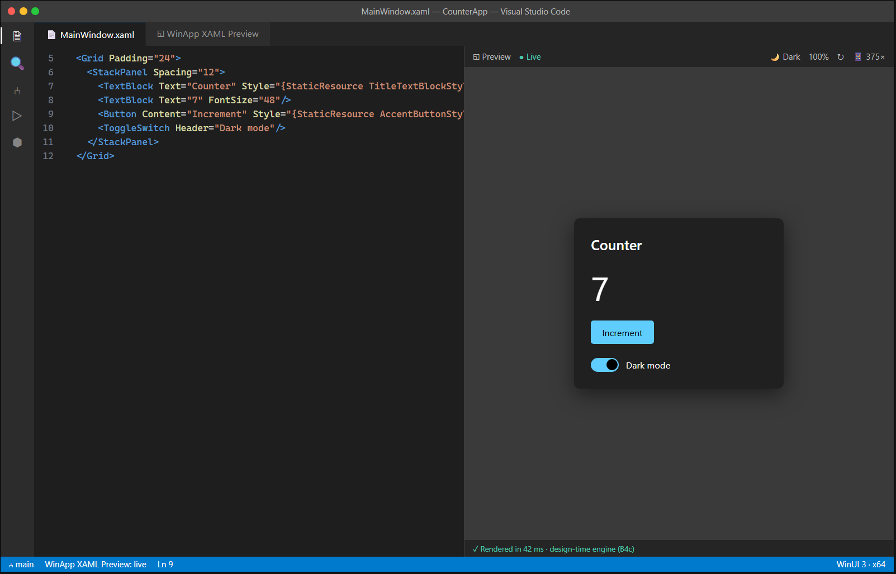

# C3 — XAML Visualiser (live preview)

| | |
|---|---|
| **Spec ID** | C3 |
| **Roadmap area** | C (editor delivery surface) |
| **Depends on** | **B4c** (design-time engine — XAML visualiser support), B (winui CLI project model) |
| **Status** | Draft for discussion |
| **Estimated effort** | **10–16 engineer-weeks** (extension/host side; **excludes** B4c engine); see [Effort](#effort--phasing) |

---

## 1. Summary

A **read-only, real-time preview** of a XAML page/control rendered next to the editor. As the developer
edits XAML, a preview pane updates live to show the rendered UI, with light/dark/high-contrast theme
switching, device/size presets, and zoom. The actual rendering is produced by the **B4c design-time
engine**; C3 is the VS Code surface that hosts the rendered output, streams XAML changes to the engine,
and presents theme/size controls. It is the "see it without running it" companion to the language server
(C1) and a stepping stone to the interactive designer (C4).



## 2. Problem / motivation

WinUI 3 XAML has **no live preview in VS Code** — you must build and run to see layout, and even VS's
XAML Designer for WinUI 3 is limited. Iterating on spacing, styles, and control composition means a
build-run-look-repeat loop measured in tens of seconds. A live visualiser collapses that to instant
feedback, which is the highest-frequency inner-loop activity in UI work. This is table stakes for
Avalonia and Uno in VS Code today; WinUI needs parity.

## 3. Prior art & competitive analysis

| Tool | Approach | Implication for C3 |
|------|----------|--------------------|
| **Avalonia Previewer (VS Code)** | Out-of-process design-time host renders the control in isolation with design-time data; editor streams XAML deltas. | Closest model to C3. Renders a control/page in isolation, not full app. Good UX baseline. |
| **Uno Hot Design / Hot Reload (VS Code)** | Renders inside the **running app** on any target; editor is a relay. | An alternative philosophy (preview = the live app). We treat that as **C5 hot reload**; C3 is the *design-time* (not-running) preview. |
| **VS XAML Live Preview** | Shows the running app's UI in an IDE pane. | Again running-app centric → overlaps C5/C6, not C3. |
| **VS XAML Designer (WPF/UWP)** | Design-time render surface; weak/absent for WinUI 3. | The gap C3 (+C4) closes for WinUI. |

**Takeaway:** two industry patterns — **design-time isolated render** (Avalonia) vs **running-app render**
(Uno/VS Live Preview). C3 deliberately owns the **design-time** path (no build/run required), because
instant feedback while the app isn't running is the differentiator; the running-app inspection story is
C5/C6. This split should be stated explicitly to the team.

## 4. Goals / non-goals

**Goals**
- Live preview pane (side-by-side or separate tab) that re-renders on XAML edit, debounced.
- Theme toggle: Light / Dark / High Contrast. Size presets (window sizes, common breakpoints) + custom.
- Zoom / pan; DPI-accurate rendering; background/checkerboard for transparency.
- Design-time data support (`d:DataContext`, `d:DesignWidth/Height`, sample data) so data-bound UI shows content.
- Graceful error surface: when XAML can't render, show the parse/runtime error in the pane, keep last-good render.
- Works in VS Code / Cursor / Windsurf (webview-based host; no editor-proprietary rendering).

**Non-goals**
- Editing via the preview (drag/drop, selection→XAML) — that's **C4**.
- Inspecting a *running* app's live tree — that's **C6**.
- Pixel-perfect guarantee for every third-party/custom-drawn control (best-effort via the engine).

## 5. Proposed implementation

```
VS Code Webview (preview pane)  ◀──img/stream──  C3 host (extension)
        │  theme/size/zoom UI                         │  spawns + supervises
        │  error overlay                               ▼
        └──────────────── XAML text + context ──▶  B4c design-time render engine
                                                     (renders control/page → frames/bitmap,
                                                      resolves types/resources/themes)
```

- **Render source (B4c):** the engine loads the XAML in a design-time context, resolves the project's
  types/resources/styles (shared with C1's type system), and produces rendered output — either a bitmap
  per change or a lightweight frame stream. C3 does **not** render XAML itself.
- **Transport:** the engine runs as a child process; communicate over a local socket/stdio JSON protocol
  (send: XAML doc + project context + theme/size; receive: image + hit-test metadata + errors). Metadata
  (element bounds) is optional for C3 but forward-compatible with C4.
- **Host/UI:** a VS Code **webview** shows the image with a toolbar (theme, size, zoom, refresh). The
  extension watches the active XAML doc, debounces edits (~150–300 ms), and forwards them.
- **Project context:** obtain refs/resource dictionaries/TFM from the winapp CLI project model (B);
  reuse restore output so custom controls and `StaticResource`s resolve.

## 6. API / contribution surface

```jsonc
"contributes": {
  "commands": [
    { "command": "winapp.xaml.openPreview", "title": "WinApp: Open XAML Preview", "category": "WinApp" },
    { "command": "winapp.xaml.openPreviewToSide", "title": "WinApp: Open XAML Preview to the Side", "category": "WinApp" }
  ],
  "menus": { "editor/title": [{ "command": "winapp.xaml.openPreviewToSide", "when": "resourceExtname == .xaml", "group": "navigation" }] },
  "configuration": {
    "winapp.xaml.preview.theme": { "enum": ["light","dark","highContrast"], "default": "dark" },
    "winapp.xaml.preview.defaultSize": { "type": "string", "default": "1280x720" },
    "winapp.xaml.preview.autoRefresh": { "type": "boolean", "default": true },
    "winapp.xaml.preview.refreshDebounceMs": { "type": "number", "default": 200 }
  }
}
```
**Design-time render protocol (host ↔ B4c), illustrative:**
```jsonc
// → render request
{ "op":"render", "uri":"MainWindow.xaml", "text":"<Grid…", "project":"CounterApp.csproj",
  "theme":"dark", "size":{"w":375,"h":720}, "dpi":1.25, "wantHitTest":false }
// ← render result
{ "op":"frame", "png":"<base64|shared-mem handle>", "width":375, "height":720,
  "diagnostics":[{ "severity":"error", "message":"Cannot find resource 'TitleStyle'", "line":7 }] }
```

## 7. Design tradeoffs & alternatives

- **Design-time render vs running-app preview.** Design-time (this spec) gives feedback with no build/run
  and no identity/cert friction, but can diverge from runtime for code-driven UI. Running-app preview is
  truest but slow to start and belongs to C5/C6. Recommend design-time for C3, clearly scoped.
- **Bitmap-per-change vs frame stream.** Bitmaps are simplest and plenty for a preview; a stream enables
  animations/interaction later (C4). Start with debounced bitmaps; design the protocol to allow streaming.
- **Webview image vs native overlay window.** Webview keeps parity across Cursor/Windsurf and docks
  naturally; a native child window could be crisper but breaks the editor-agnostic goal. Choose webview.
- **Isolation scope: control vs whole window.** Rendering a single `UserControl`/`Page` is fast and
  matches Avalonia; whole-window may need app resources. Support page/control first.

## 8. What will / won't be supported

| Supported (v1) | Not in v1 |
|---|---|
| Live design-time render of a Page/UserControl | Editing from the preview (C4) |
| Light/Dark/High-Contrast, size presets, zoom | Inspecting a running app (C6) |
| Design-time data (`d:` namespace) | Guaranteed fidelity for custom-drawn/Composition visuals |
| Inline render/parse error overlay | Animation timeline scrubbing |
| VS Code / Cursor / Windsurf | Non-WinUI XAML dialects (depends on engine) |

## 9. Dependencies & risks

- **Hard dependency on B4c.** Without the design-time render engine, C3 cannot exist; C3's timeline is
  gated by B4c. This spec covers only the host/UI/protocol side.
- **Custom control resolution** requires a restored/reference-complete project; degrade to placeholders.
- **Performance:** render latency + image transport must stay well under a second to feel "live."

## 10. Open questions

1. What exactly does B4c emit — bitmaps, a retained visual tree, or a frame stream — and what's its API/timeline?
2. Does B4c run WinUI in a real (headless) render context on the dev machine, or a portable renderer?
   (Determines fidelity and cross-arch behavior, e.g. x64 vs arm64 hosts.)
3. Page/control isolation vs full-window preview for v1?
4. How do we source design-time sample data — `d:` only, or a richer sample-data mechanism?
5. Shared-memory vs base64-over-socket for frame transport (perf vs simplicity)?

## Effort & phasing

> Extension/host side only; **excludes** B4c engine work, which is the critical dependency. Confidence: low-medium (engine-gated).

| Phase | Scope | Estimate |
|-------|-------|----------|
| P1 | Webview host, engine process supervision, render protocol, basic live preview | 4–6 wk |
| P2 | Theme/size/zoom controls, design-time data, error overlay, debounce/perf | 3–5 wk |
| P3 | Project-context/custom-control resolution, multi-editor QA, hardening | 3–5 wk |
| **Total** | | **10–16 engineer-weeks** |
