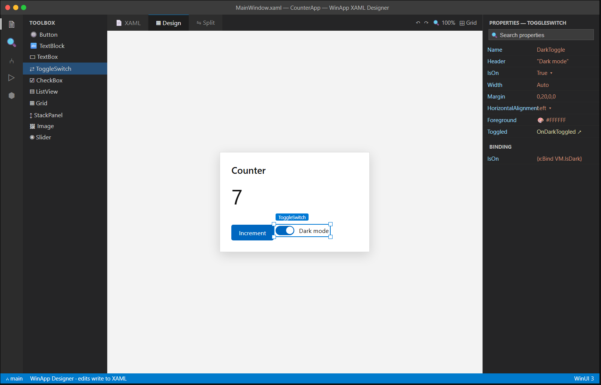

# C4 — XAML Designer (interactive)

| | |
|---|---|
| **Spec ID** | C4 |
| **Roadmap area** | C (editor delivery surface) |
| **Depends on** | **B4b** (design-time engine — designer support), C3 (visualiser host), C1 (type system) |
| **Status** | Draft for discussion |
| **Estimated effort** | **28–44 engineer-weeks** (host/interaction side; **excludes** B4b engine); see [Effort](#effort--phasing) |

---

## 1. Summary

An **interactive visual XAML designer** in VS Code: a design surface where you drag controls from a
toolbox, select and move/resize elements with handles, and edit properties in a property grid — with all
changes written back to the XAML text (two-way, text-authoritative). It builds on C3's rendered surface
(via **B4b**), adding hit-testing, selection, manipulation, a toolbox, and a property/events panel. This
is the most ambitious C-item and the closest thing to Visual Studio's / Blend's XAML designer for VS Code.



## 2. Problem / motivation

Visual, WYSIWYG UI construction is a major reason developers stay in Visual Studio / Blend on Windows.
VS Code has **no** interactive WinUI designer. Engineers who prefer VS Code (or must use Cursor/Windsurf)
either hand-write all XAML or context-switch to VS. A designer that round-trips cleanly to hand-authored
XAML (no designer lock-in, no messy generated markup) would remove a headline reason to leave the editor.

## 3. Prior art & competitive analysis

| Tool | Approach | Implication for C4 |
|------|----------|--------------------|
| **Visual Studio XAML Designer / Blend** | Full design surface, drag/drop, property grid, states/animations; WPF/UWP strong, **WinUI 3 limited**. | The bar to clear; also a caution — WinUI 3 designer parity is hard, so scope carefully. |
| **Uno Hot Design** | Runtime designer: manipulate the **running** app; changes hot-reloaded to source. | Alternative architecture (design against a live app). Powerful but couples design to run + hot reload (C5). Consider as a later mode. |
| **Avalonia** | Strong previewer; interactive design is limited. | Confirms interactive design is the hard part; most tools stop at preview (C3). |
| **Web designers (Webflow, Figma-to-code)** | Direct-manipulation → code. | UX inspiration for handles/snap/guides, but our output must be clean, diff-friendly XAML. |

**Takeaway:** interactive WinUI design is genuinely hard and under-served. Two paths: **design-time**
(extend C3's engine with editing — B4b) or **runtime** (Uno-style, against a running app). Recommend
starting **design-time** for a no-run inner loop, and keeping a runtime mode as a future option shared
with C5/C6.

## 4. Goals / non-goals

**Goals**
- Toolbox of common WinUI controls; drag-drop onto the surface inserts well-formed XAML at the right node.
- Selection via click; multi-select; move/resize with handles; alignment guides + snapping; grid/margin editing.
- Property grid (typed editors: enums as dropdowns, brushes as color pickers, thickness/size editors,
  resource pickers) and an **Events** section that creates/navigates to handler stubs in code-behind.
- **Text-authoritative round-trip:** every design edit is a minimal, formatting-preserving XAML text edit;
  hand-edits in the XAML reflect back in the designer. No proprietary designer metadata in the file.
- Undo/redo integrated with VS Code's text undo stack.
- Layout container awareness (Grid rows/cols, StackPanel order, Canvas coordinates).
- Works in VS Code / Cursor / Windsurf.

**Non-goals (v1)**
- Visual states / storyboard / animation authoring (Blend-level) — future.
- Style/template/`ControlTemplate` visual editing — edit as text for now.
- Data-binding designer wizardry beyond a basic `{x:Bind}`/`{Binding}` helper.
- Designing against a running app (runtime mode) — future, shared with C5.

## 5. Proposed implementation

```
VS Code Webview (design surface)
   toolbox │ canvas(select/drag/resize) │ property+events grid
        ▲            │ manipulation intents (move X to (r,c), set prop, insert control)
   render frames     ▼
   + hit-test   C4 interaction controller (extension)
   metadata          │  ├─ maps intents → minimal XAML text edits (formatting-preserving)
        ▲            │  ├─ maps text edits → re-render + reselect (round-trip)
        └── B4b design-time engine (render + hit-test + layout metadata) ── uses C1 type system
```

- **B4b engine** provides: render frames (as C3), **hit-testing** (point → element), **element bounds &
  layout metadata**, and property metadata (types, defaults, categories). C4 consumes these; it does not
  render or lay out itself.
- **Interaction controller** turns gestures into **XAML text mutations** using an AST/CST that preserves
  whitespace/comments/attribute order (reuse the manifest editor's format-preserving edit approach and/or
  C1's parser). This keeps the file authoritative and diff-clean.
- **Property grid** is generated from B4b/C1 property metadata; value editors chosen by type.
- **Events** create handler stubs in the paired `.xaml.cs` (Roslyn) and wire the attribute.
- **Selection sync:** editor caret ↔ selected element ↔ property grid stay in sync.

## 6. API / contribution surface

```jsonc
"contributes": {
  "customEditors": [{
    "viewType": "winapp.xamlDesigner",
    "displayName": "WinApp XAML Designer",
    "selector": [{ "filenamePattern": "**/*.xaml" }],
    "priority": "option"        // opt-in; text editor remains default
  }],
  "commands": [
    { "command": "winapp.xaml.openDesigner", "title": "WinApp: Open in XAML Designer", "category": "WinApp" },
    { "command": "winapp.xaml.toggleDesignerSplit", "title": "WinApp: Toggle Designer/XAML Split", "category": "WinApp" }
  ],
  "configuration": {
    "winapp.designer.snapToGuides": { "type": "boolean", "default": true },
    "winapp.designer.showGrid": { "type": "boolean", "default": true },
    "winapp.designer.defaultInsertContainer": { "enum": ["auto","grid","stackpanel"], "default": "auto" }
  }
}
```
**Interaction protocol (surface ↔ controller), illustrative:**
```jsonc
{ "op":"select", "elementId":"btnIncrement" }
{ "op":"move", "elementId":"DarkToggle", "toGridCell":{ "row":3, "col":0 }, "margin":"0,20,0,0" }
{ "op":"setProperty", "elementId":"DarkToggle", "name":"IsOn", "value":"True" }
{ "op":"insert", "control":"ToggleSwitch", "parentId":"rootStack", "index":2 }
{ "op":"addEventHandler", "elementId":"DarkToggle", "event":"Toggled" }  // → stub in .xaml.cs
```

## 7. Design tradeoffs & alternatives

- **Text-authoritative vs designer-authoritative.** Text-authoritative avoids lock-in and keeps diffs
  clean but makes some manipulations (e.g. re-parenting inside complex templates) harder to express as
  minimal edits. Strongly recommend text-authoritative — it's what serious XAML developers expect.
- **Design-time vs runtime designer.** Design-time = no build/run, but lower fidelity for code-driven UI;
  runtime (Uno-style) = high fidelity but heavier and couples to C5. Start design-time.
- **Custom editor (replaces text view) vs side-by-side webview.** A `customEditor` gives a full surface but
  hides the text; a side-by-side/split keeps text visible. Recommend **split** as default UX with an
  optional full custom-editor mode.
- **Scope creep risk.** Blend-level features (states, animations, templates) are enormous. Explicitly cut
  them from v1 to keep the designer shippable.

## 8. What will / won't be supported

| Supported (v1) | Not in v1 |
|---|---|
| Drag/drop toolbox insert, select, move/resize, snap | Visual states / storyboards / animations |
| Property grid with typed editors + resource/color pickers | `ControlTemplate` / `Style` visual editing |
| Event handler stub generation + navigation | Runtime (running-app) design mode |
| Grid/StackPanel/Canvas layout editing | Designing 3rd-party controls without design metadata |
| Text-authoritative, formatting-preserving round-trip | Multi-file/merged resource-dictionary design |

## 9. Dependencies & risks

- **Hard dependency on B4b** for render + hit-test + layout/property metadata; C4 is gated by it.
- **Round-trip correctness** is the top engineering risk — minimal, faithful text edits across arbitrary
  hand-authored XAML is subtle; needs a strong CST and extensive tests.
- **Fidelity expectations:** users will compare to VS/Blend; manage scope + messaging.
- **Effort:** this is a multi-quarter effort even with B4b; consider staging behind C3 + C1 maturity.

## 10. Open questions

1. Does B4b expose hit-testing, layout rects, and re-parenting affordances — and on what timeline?
2. Custom-editor (full surface) vs split-with-text as the primary UX?
3. How much layout-container intelligence in v1 (Grid definitions editor? auto-`Grid.Row` assignment?)?
4. Do we invest in a shared CST with C1, or a designer-specific editor model?
5. Is a future **runtime** design mode (shared with C5/C6) in scope for the roadmap, and does that change v1 architecture?

## Effort & phasing

> Host/interaction side only; **excludes** B4b engine. This is the largest C-item — treat estimates as
> planning-grade with **low** confidence until B4b's API is defined.

| Phase | Scope | Estimate |
|-------|-------|----------|
| P1 | Design surface host + selection/hit-test + property grid (read/edit simple props) | 8–12 wk |
| P2 | Toolbox drag/drop insert, move/resize/snap, layout-container editing, undo integration | 10–16 wk |
| P3 | Events→code-behind, resource/color pickers, round-trip hardening, multi-editor QA | 10–16 wk |
| **Total** | | **28–44 engineer-weeks** |
