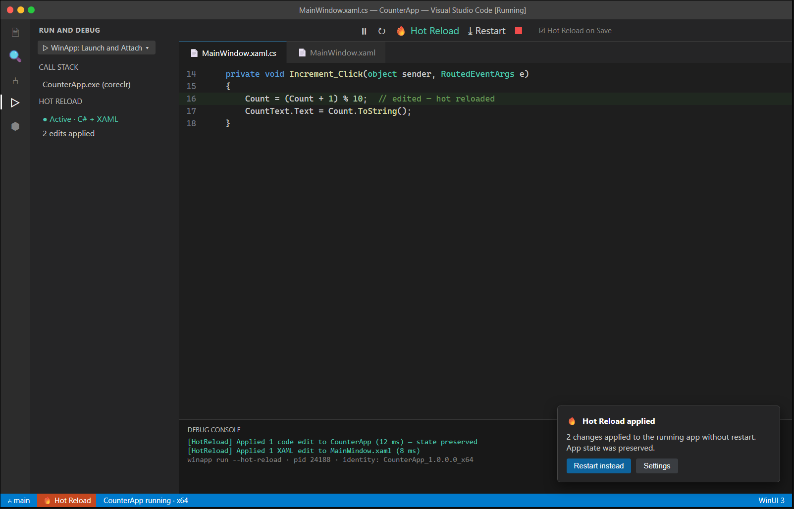

# C5 — Run and Hot Reload

| | |
|---|---|
| **Spec ID** | C5 |
| **Roadmap area** | C (editor delivery surface) |
| **Depends on** | **B2** (run), **B3** (hot reload) in the winui CLI; existing `winapp` debug type |
| **Status** | Draft for discussion |
| **Estimated effort** | **10–16 engineer-weeks** (editor integration; **excludes** B2/B3 runtime); see [Effort](#effort--phasing) |

---

## 1. Summary

Bring **run + hot reload** into the VS Code inner loop for WinUI/Windows apps: press F5 (or a Run button)
to launch the app with package identity via the winui CLI (B2), then apply **C# and XAML edits to the
running app without restarting** (B3), preserving app state. C5 is the editor experience — run
controls, a Hot Reload toolbar/status affordance, "apply on save" behavior, and clear success/failure
feedback — layered on the CLI's run + hot-reload capabilities. It extends the extension's existing
`winapp` debug type (which already launches with identity and attaches a debugger).



## 2. Problem / motivation

**WinUI 3 has no XAML hot reload outside Visual Studio**, and even C# hot reload in VS Code is limited for
WinUI. Today the extension's F5 flow launches and attaches, but every code/XAML change requires a full
rebuild + relaunch — the slowest part of the WinUI inner loop and a top reason to stay in VS. Our
battle-testing explicitly noted "the debug flow is excellent once configured, but any change means
rebuild + relaunch." Closing this gap is one of the highest-leverage productivity wins in the roadmap.

## 3. Prior art & competitive analysis

| Tool | Approach | Implication for C5 |
|------|----------|--------------------|
| **Visual Studio Hot Reload** | C# (EnC/`MetadataUpdater`) + XAML hot reload; deep runtime integration; WinUI supported. | Feature bar. C5 should reach C#+XAML hot reload parity for the common cases. |
| **`dotnet watch`** | C# hot reload from CLI; **no XAML hot reload for WinUI 3**; XAML change → rebuild. | We must not rely on `dotnet watch` for XAML; B3 must supply the WinUI XAML hot-reload agent. |
| **C# Dev Kit (VS Code)** | C# hot reload in some scenarios; **no WinUI XAML hot reload**. | We already depend on the C# extension for `coreclr` debug; C5 coordinates hot reload around/with it. |
| **Uno Hot Reload (VS Code)** | Embeds a hot-reload agent in the app; editor relays XAML/C# deltas over a socket. | Architectural template for B3's agent + C5's relay/UX. |

**Takeaway:** the **C# side** can leverage the .NET runtime's `MetadataUpdater`/EnC (as VS/`dotnet watch`
do); the **XAML side** needs a **WinUI hot-reload agent** in the app process (B3), Uno-style, that patches
the visual tree. C5's job is to drive both from the editor and present a coherent experience.

## 4. Goals / non-goals

**Goals**
- One-gesture **Run** (F5 and a WinApp Run button/menu) that launches with identity via B2 and attaches
  the right debugger (reusing the existing `winapp` debug type).
- **Hot Reload on save** (and an explicit "Apply Changes" command) for supported C# edits and XAML edits,
  with state preserved.
- Clear status: a Hot Reload status-bar item + toolbar button (active/applying/failed), and a concise
  notification on apply or on rude-edit fallback.
- **Graceful degradation:** when an edit can't be hot-reloaded (rude edit), offer a one-click Restart.
- Optional **auto-build** integration so Run doesn't require a manual pre-build (addresses a known F5 gap).
- Works in VS Code / Cursor / Windsurf.

**Non-goals**
- The hot-reload runtime/agent itself (that's **B3**); C5 orchestrates and surfaces it.
- Live visual-tree inspection / property editing (that's **C6**).
- Edit-and-continue for native C++ beyond what the underlying debugger supports.

## 5. Proposed implementation

```
VS Code (C5)                         Running app (identity via B2)
  Run button / F5 ─▶ winapp run ────▶  app process ◀── B3 hot-reload agent (in-proc)
  file save ─▶ debounce ─▶ compute delta                 ▲
     ├─ C# delta ─▶ MetadataUpdater/EnC via debug session │ patch visual tree / apply IL
     └─ XAML delta ─▶ send to B3 agent ─────────────────────┘
  status bar / toolbar / notifications ◀── apply results (ok / rude edit / error)
```

- **Launch:** reuse/extend the `winapp` debug type. Add first-class Run entry points (command, editor
  button, WinApp view — see C7) so users aren't reliant only on `launch.json`.
- **C# hot reload:** drive via the .NET runtime update mechanism through the active debug session
  (coordinate with the C# extension / `coreclr`). Where the C# extension owns EnC, integrate rather than
  duplicate; otherwise apply `MetadataUpdater` deltas ourselves through B2/B3.
- **XAML hot reload:** on XAML save, send the changed document (or delta) to the **B3 agent** in the app,
  which re-parses and patches the live visual tree (Uno-style). Preserve `DataContext`/state.
- **Change detection:** watch dirty docs; debounce; classify edit → applicable vs rude; on rude edit,
  prompt Restart.
- **Feedback:** status-bar item (`🔥 Hot Reload`), toolbar button in the debug toolbar, and Debug Console
  log lines mirroring what the CLI reports.

## 6. API / contribution surface

```jsonc
"contributes": {
  "commands": [
    { "command": "winapp.run", "title": "WinApp: Run Application", "category": "WinApp" },
    { "command": "winapp.hotReload.applyChanges", "title": "WinApp: Apply Hot Reload Changes", "category": "WinApp" },
    { "command": "winapp.hotReload.restart", "title": "WinApp: Restart (rude edit)", "category": "WinApp" },
    { "command": "winapp.hotReload.toggleOnSave", "title": "WinApp: Toggle Hot Reload on Save", "category": "WinApp" }
  ],
  "configuration": {
    "winapp.hotReload.enable": { "type": "boolean", "default": true },
    "winapp.hotReload.onSave": { "type": "boolean", "default": true },
    "winapp.hotReload.xaml": { "type": "boolean", "default": true },
    "winapp.hotReload.csharp": { "type": "boolean", "default": true },
    "winapp.run.autoBuild": { "type": "boolean", "default": true }
  },
  "debuggers": [{ "type": "winapp", "//": "extend existing with hotReload launch attrs" }]
}
```
- **New `launch.json` attrs (winapp debug type):** `hotReload: boolean`, `hotReloadOnSave: boolean`.
- **Editor UI:** debug-toolbar button + status-bar item + apply/rude-edit notifications.

## 7. Design tradeoffs & alternatives

- **Reuse C# extension's EnC vs own the C# delta path.** Reuse avoids duplicating a mature EnC engine and
  reduces conflicts, but depends on that extension's public surface; owning it via B2/B3 is more control
  but more work and possible contention with the debugger. Prefer coordination; fall back to owning only
  if necessary.
- **XAML delta granularity.** Whole-document re-apply is simplest and robust; fine-grained diffs are
  faster and preserve more state. Start whole-document, optimize later.
- **Auto-build default on/off.** Auto-build removes a real footgun (running stale binaries) but adds
  latency and can surprise users; default on with a clear setting.
- **State preservation depth.** Full state preservation is ideal but some edits force reconstruction;
  communicate clearly when state is/ isn't kept.

## 8. What will / won't be supported

| Supported (v1) | Not in v1 |
|---|---|
| Run with identity (F5 + Run button/menu) | The hot-reload runtime/agent (B3 owns it) |
| C# hot reload for supported (non-rude) edits | Guaranteed EnC for every edit shape |
| XAML hot reload (visual-tree patch) with state | Native C++ EnC beyond debugger support |
| Hot Reload on save + explicit apply + rude-edit restart | Live tree/property inspection (C6) |
| Auto-build before run (optional) | Hot reload of resource dictionaries/app-wide styles (fast-follow) |

## 9. Dependencies & risks

- **Gated by B2 (run) and B3 (hot reload agent).** C5 cannot deliver XAML hot reload without B3's in-proc
  agent; C# hot reload needs B2/B3 to expose the delta-apply path or coordinate with the C# extension.
- **Debugger coordination:** hot reload while a debugger is attached (coreclr) needs careful sequencing to
  avoid conflicts.
- **Rude-edit UX:** misclassifying edits erodes trust; needs solid detection + honest messaging.

## 10. Open questions

1. Does B3 apply C# deltas itself, or do we route through the C# extension's EnC? What's the contract?
2. What's the B3 XAML agent's protocol (whole-doc vs delta; what state survives)?
3. Should Run/hot-reload work **without** an attached debugger (fast "just run + hot reload" mode)?
4. Auto-build via `preLaunchTask` vs a CLI `winapp build` step — which is the default mechanism?
5. How do C++ and non-.NET frameworks (Rust/Tauri/Electron) fit hot reload, if at all?

## Effort & phasing

> Editor-integration side; **excludes** B2/B3 runtime. Confidence: medium (C# path) / low (XAML path, B3-gated).

| Phase | Scope | Estimate |
|-------|-------|----------|
| P1 | First-class Run entry points + auto-build + debug-type extension | 3–4 wk |
| P2 | C# hot-reload orchestration + status/toolbar/notification UX + rude-edit flow | 4–6 wk |
| P3 | XAML hot-reload relay to B3 agent, on-save pipeline, multi-editor QA | 3–6 wk |
| **Total** | | **10–16 engineer-weeks** |
