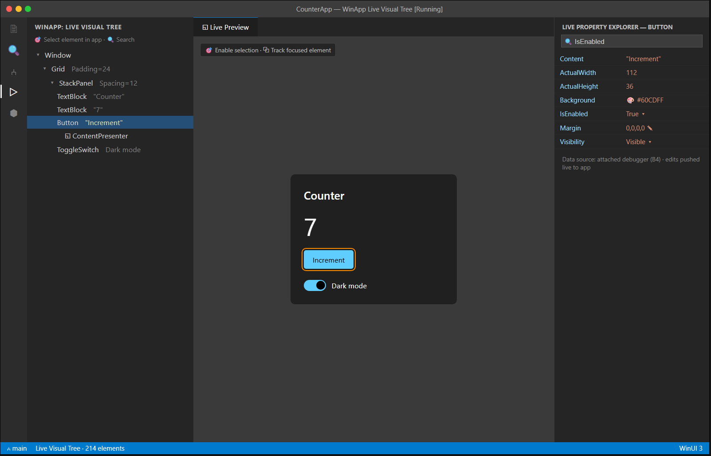

# C6 — Visual Tree & Property Editor Dev Tooling

| | |
|---|---|
| **Spec ID** | C6 |
| **Roadmap area** | C (editor delivery surface) |
| **Depends on** | **B4** (shared design-time engine — runtime inspection/introspection), C5 (running app + attach) |
| **Status** | Draft for discussion |
| **Estimated effort** | **12–20 engineer-weeks** (editor tooling; **excludes** B4 inspection engine); see [Effort](#effort--phasing) |

---

## 1. Summary

Runtime UI dev-tooling for a **running** WinUI app, inside VS Code: a **Live Visual Tree** (the live
element hierarchy), a **Live Property Explorer** (inspect and live-edit properties of the selected
element), element selection from the running app ("enable selection" → click in app → highlight in tree),
and a live preview/track-focused-element view. Data comes from the **B4** design-time/inspection engine
via the attached debug session; C6 is the VS Code tree/grid/preview UI around it — the VS Code answer to
Visual Studio's Live Visual Tree + Live Property Explorer.



## 2. Problem / motivation

When a WinUI layout misbehaves at runtime, VS Code offers **nothing** to inspect the live UI — no tree, no
property inspector, no "what element is this?" picker. Visual Studio's Live Visual Tree / Live Property
Explorer are indispensable for debugging layout, styles, bindings, and z-order; their absence is a real
reason Windows engineers keep VS open alongside VS Code. C6 brings that runtime inspection loop to VS
Code and its AI forks, complementing static preview (C3) and hot reload (C5).

## 3. Prior art & competitive analysis

| Tool | Approach | Implication for C6 |
|------|----------|--------------------|
| **VS Live Visual Tree + Property Explorer** | Debugger-attached; reads the live XAML object model (visual tree, `DependencyProperty` values); select-in-app; live edits. | Direct feature parity target. |
| **Uno Hot Design** | Runtime manipulation of the running app's tree. | Overlaps C6 (inspect) + C4 (edit); shows the runtime-agent model works in VS Code. |
| **Browser DevTools / React DevTools / Flutter Inspector** | Element tree + props + pick-from-canvas + live edit. | Proven UX patterns (tree ↔ highlight ↔ property grid, "inspect" cursor) to mirror. |
| **WinAppSDK/WinUI inspection APIs** | `VisualTreeHelper`, `DependencyProperty` metadata, `xamldiagnostics` (the API VS uses). | The likely data source B4 wraps; determines fidelity/perf. |

**Takeaway:** the established model is **debugger-attached runtime inspection** exposing the live object
model. WinUI already has the diagnostics plumbing VS uses (`Microsoft.VisualStudio.DesignTools.*` /
`xamldiagnostics`); B4 should expose that to C6 through the attached session so we don't reinvent it.

## 4. Goals / non-goals

**Goals**
- **Live Visual Tree** view: hierarchical element tree of the running app, updating as UI changes;
  search/filter; show key attributes (name, size, key props) inline.
- **Select-in-app ("inspect")**: toggle a picker; clicking an element in the running app selects it in the
  tree and property explorer (and vice-versa: selecting in the tree highlights it in the app).
- **Live Property Explorer**: property grid for the selected element with current values, grouped/
  searchable; **live-edit** common properties (dimensions, margins, brushes, visibility, IsEnabled) with
  immediate effect in the running app.
- **Track focused element** and a **live preview** thumbnail of the app (reuses C3's rendering surface where possible).
- Jump from an element to its XAML definition (`x:Name`/source line) when available.
- Works in VS Code / Cursor / Windsurf, only while a `winapp`/attached debug session is live.

**Non-goals**
- Persisting live edits back to source XAML (that's designer/hot-reload territory — C4/C5; C6 edits are
  runtime-only unless explicitly bridged later).
- Static (not-running) inspection — that's C3/C4.
- Full performance profiler / layout-cycle counters (future dev-tools expansion).

## 5. Proposed implementation

```
VS Code (C6)                                Running app (debug session attached)
  Live Visual Tree (TreeView) ◀── tree/updates ── B4 inspection engine ──▶ WinUI xaml-diagnostics
  Live Property Explorer (webview grid) ◀── prop values / metadata          (VisualTreeHelper,
  Inspect toggle ─▶ enter pick mode ─────────────▶ agent highlights + returns hit element
  edit property ─────────────────────────────────▶ agent sets DependencyProperty (live)
  Live preview thumbnail ◀── frames ─────────────  (optionally reuse C3 surface)
```

- **Data source (B4):** an in-app inspection agent (or the WinUI xaml-diagnostics channel) exposes: tree
  enumeration + change notifications, per-element property metadata + live values, hit-testing/highlight,
  and property set. Delivered over the debug session's side channel or a local socket the agent opens.
- **Tree UI:** a VS Code `TreeDataProvider` in a dedicated view container (see C7's WinApp view). Virtualize
  for large trees (thousands of elements); lazy-expand.
- **Property grid:** a webview grid (typed editors, search, grouping) fed by B4 metadata; edits post back
  to the agent. Reuse property-editor components with C4 where possible.
- **Inspect/highlight:** agent draws an adorner/overlay in the app on hover/selection; C6 toggles pick mode.
- **Source mapping:** correlate runtime elements to XAML source via `x:Name` and generated line info when present.

## 6. API / contribution surface

```jsonc
"contributes": {
  "viewsContainers": { "activitybar": [{ "id": "winapp", "title": "WinApp", "icon": "images/winapp.svg" }] },
  "views": { "winapp": [
    { "id": "winapp.liveVisualTree", "name": "Live Visual Tree", "when": "winapp.debugging" },
    { "id": "winapp.livePropertyExplorer", "name": "Live Property Explorer", "when": "winapp.debugging" }
  ]},
  "commands": [
    { "command": "winapp.inspect.toggle", "title": "WinApp: Toggle Inspect (Select Element)", "category": "WinApp" },
    { "command": "winapp.inspect.trackFocused", "title": "WinApp: Track Focused Element", "category": "WinApp" },
    { "command": "winapp.inspect.goToXaml", "title": "WinApp: Go to XAML Definition", "category": "WinApp" }
  ]
}
```
**Inspection protocol (C6 ↔ B4 agent), illustrative:**
```jsonc
{ "op":"getTree", "root":"window" }                       // → nodes[] {id,type,name,childrenCount,keyProps}
{ "op":"getProps", "elementId":"btnIncrement" }           // → props[] {name,type,value,category,readOnly}
{ "op":"setProp", "elementId":"btnIncrement", "name":"IsEnabled", "value":"false" }
{ "op":"pick", "enable":true }                             // ← event: {op:"picked", elementId:"…"}
{ "op":"highlight", "elementId":"btnIncrement" }
```

## 7. Design tradeoffs & alternatives

- **Transport: debug-session side channel vs standalone socket.** Side channel ties inspection to the
  debug session lifecycle (clean, secure); a standalone socket is simpler to prototype but needs its own
  lifetime/security handling. Prefer the attached-session channel.
- **Poll vs push tree updates.** Push (change notifications) keeps the tree live but is chattier; polling is
  simpler but laggy. Push with coalescing recommended.
- **Live-edit scope.** Editing all properties live is powerful but risky (some setters throw / need UI
  thread marshalling). Start with a curated, safe property set; expand.
- **Reuse C3 for preview vs separate.** Reuse cuts work and keeps one rendering path; but C3 is design-time
  while C6 is the *actual* running app — the preview here should reflect the live app, so it may need the
  agent's frames rather than C3's design-time render. Clarify with B4.

## 8. What will / won't be supported

| Supported (v1) | Not in v1 |
|---|---|
| Live visual tree of the running app + search | Persisting live edits back to XAML source |
| Select-in-app (inspect) ↔ tree ↔ property grid | Full profiler / layout-cycle diagnostics |
| Live property view + edit of a safe property set | Time-travel / snapshot history |
| Track focused element, go-to-XAML | Remote-device inspection (future) |
| Runs only during an attached debug session | Non-WinUI UI stacks |

## 9. Dependencies & risks

- **Gated by B4** exposing runtime inspection (tree/props/hit-test/set) over the session.
- **UI-thread & performance:** enumerating/patching a live tree must marshal correctly and not stall the app.
- **Fidelity of source mapping** (runtime element → XAML line) depends on available diagnostics metadata.
- **Security:** the inspection channel must be dev-only and scoped to the local debug session.

## 10. Open questions

1. What inspection surface does B4 provide — WinUI `xamldiagnostics` passthrough, or a custom agent API?
2. Does the preview here come from the running app (agent frames) or C3's design-time render?
3. Which properties are safe to live-edit in v1, and how do we handle setters that throw / need marshalling?
4. Can we reliably map runtime elements back to XAML source lines across build configurations?
5. Should live edits be optionally "promotable" to source (bridge to C4/C5), or strictly runtime-only?

## Effort & phasing

> Editor-tooling side; **excludes** B4 inspection engine. Confidence: low-medium (B4-gated).

| Phase | Scope | Estimate |
|-------|-------|----------|
| P1 | View container + Live Visual Tree (read + search) over attached session | 4–7 wk |
| P2 | Live Property Explorer (read) + select-in-app/highlight + go-to-XAML | 4–7 wk |
| P3 | Live property editing (safe set), focused-element tracking, preview, perf/QA | 4–6 wk |
| **Total** | | **12–20 engineer-weeks** |
