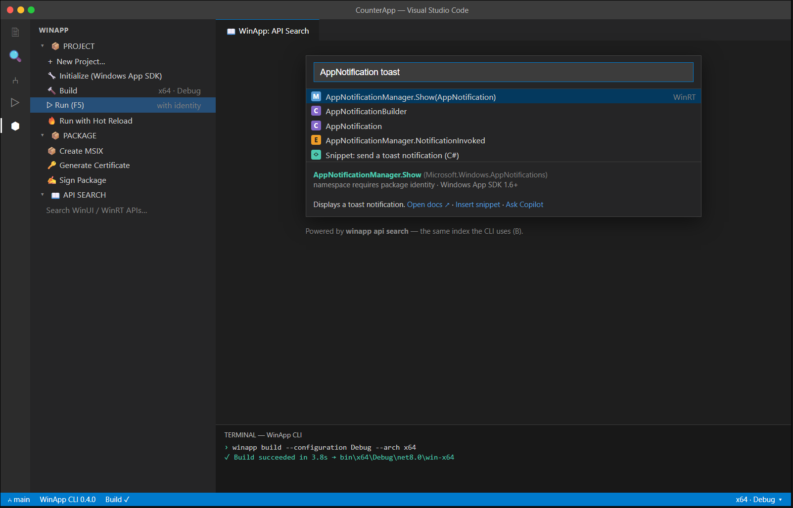

# C7 — Surface WinUI CLI Commands (new / build / run, API search)

| | |
|---|---|
| **Spec ID** | C7 |
| **Roadmap area** | C (editor delivery surface) |
| **Depends on** | **B** (winui/winapp CLI — `new`, `build`, `run`, `api search`) |
| **Status** | Draft for discussion |
| **Estimated effort** | **6–10 engineer-weeks**; see [Effort](#effort--phasing) |

---

## 1. Summary

Make the winui CLI's core developer commands **first-class, discoverable** in VS Code: project creation
(`new`), `build`, `run`, and **API search** — surfaced through a dedicated WinApp view (activity-bar
container), command-palette entries, an editor Run/Build affordance, and an in-editor **API search**
experience backed by the same index the CLI uses. Today the extension exposes packaging/manifest/cert
commands but the everyday **new → build → run** loop and API discovery aren't front-and-center. C7 closes
that, turning the extension into the primary UI for the CLI's inner loop.



## 2. Problem / motivation

The extension's power is buried in the command palette (type "WinApp"), and several everyday actions
aren't represented at all: there's **no "New Project" scaffold**, no explicit **Build** command, and no
**API search**. New users don't discover what's available; existing users drop to a terminal. Meanwhile
the CLI (B) is gaining `new`, `build`, `run`, and `api search` — these should have a home in the editor.
Our battle-testing repeatedly noted discoverability gaps (commands hidden, artifacts hard to find, no
guided starting point). C7 gives the CLI a visible, guided surface.

## 3. Prior art & competitive analysis

| Tool | Approach | Implication for C7 |
|------|----------|--------------------|
| **C# Dev Kit / .NET** | Solution Explorer view, "New Project" flow, build/run integration, templates. | Model for a WinApp view + `new` scaffold + build/run buttons. |
| **Rust-analyzer / Flutter / Tauri extensions** | Dedicated activity-bar views, command entries, project/run trees. | Confirms the view-container + tree + commands pattern. |
| **VS "Search" for APIs / IntelliCode / Learn** | Docs/API discovery inside the IDE. | API search should feel native: results → docs, snippet insert, "ask Copilot" (C8). |
| **`dotnet new` / `winget` scaffolding** | CLI template instantiation. | `new` should wrap the CLI's templates with a friendly QuickPick/wizard, not reinvent them. |

**Takeaway:** the pattern is a **thin, well-organized editor surface over the CLI** — a view container +
palette commands + a couple of buttons — plus one genuinely new capability, **API search**, which should
reuse the CLI's index (B) rather than build a separate one.

## 4. Goals / non-goals

**Goals**
- **WinApp view container** (activity bar) grouping: Project (New, Initialize, Build, Run, Run w/ Hot
  Reload) and Package (MSIX, Certificate, Sign) actions, plus entry points for C6's inspection views.
- **`new`**: a "New WinApp Project" flow — QuickPick of CLI templates (WinUI 3, WPF, console, C++, etc.),
  prompts for name/location/options, invokes `winapp new`, opens the created project.
- **`build`**: explicit Build command + editor/status affordance with configuration/arch selection;
  problem-matcher integration so errors land in the Problems panel.
- **`run`**: prominent Run entry (coordinates with C5); shows identity/arch context.
- **API search**: a command + input that queries the CLI's API index; results show API signature,
  namespace, identity/SDK requirements, with actions: open docs, insert snippet, "Ask Copilot" (→ C8).
- Configuration/architecture selector surfaced in the status bar (x64/arm64 · Debug/Release).
- Works in VS Code / Cursor / Windsurf.

**Non-goals**
- Reimplementing CLI logic — C7 wraps `winapp new/build/run/api` and parses their output.
- A full solution/project-system tree with editing (keep it action-oriented, not a mini-Solution-Explorer).
- The hot-reload runtime (C5) or inspection engine (C6) — C7 only provides their entry points.

## 5. Proposed implementation

- **View container + tree:** `viewsContainers.activitybar` → `winapp`; `TreeDataProvider`s for "Project"
  and "Package" groups with contextual actions; state-aware (`when` clauses for built/running/debugging).
- **`new` flow:** query `winapp new --list` (or bundled template manifest) → multi-step QuickPick
  (template → name → location → options) → run `winapp new` in a task → `openFolder`. Reuse the existing
  project-resolution logic for multi-root/monorepo.
- **`build`:** wrap `winapp build` as a VS Code **Task** with a `$msCompile`/custom problem matcher; add a
  Build button and configuration/arch QuickPick persisted to workspace settings (aligns with the packaging
  spec's "remember choices").
- **`run`:** delegate to C5's Run entry point; if C5 not present, run `winapp run` in a terminal/task.
- **API search:** call `winapp api search <query>` (JSON output); render results in a QuickPick (fast) and/or
  a webview panel (rich). Each result carries `docsUrl`, `namespace`, `requiresIdentity`, `minSdk`, and an
  optional `snippet`. Actions wire to `env.openExternal`, snippet insertion, and a Copilot hand-off (C8).
- **Output parsing:** standardize on JSON output from the CLI where available; fall back to text parsing.

## 6. API / contribution surface

```jsonc
"contributes": {
  "viewsContainers": { "activitybar": [{ "id": "winapp", "title": "WinApp", "icon": "images/winapp.svg" }] },
  "views": { "winapp": [
    { "id": "winapp.project", "name": "Project" },
    { "id": "winapp.package", "name": "Package" }
  ]},
  "commands": [
    { "command": "winapp.new", "title": "WinApp: New Project…", "category": "WinApp" },
    { "command": "winapp.build", "title": "WinApp: Build", "category": "WinApp" },
    { "command": "winapp.selectConfiguration", "title": "WinApp: Select Configuration/Architecture", "category": "WinApp" },
    { "command": "winapp.apiSearch", "title": "WinApp: Search APIs…", "category": "WinApp" }
  ],
  "taskDefinitions": [{ "type": "winapp", "required": ["command"],
    "properties": { "command": { "type": "string" }, "configuration": { "type": "string" }, "arch": { "type": "string" } } }],
  "configuration": {
    "winapp.build.configuration": { "enum": ["Debug","Release"], "default": "Debug" },
    "winapp.build.architecture": { "enum": ["x64","arm64","x86"], "default": "x64" },
    "winapp.apiSearch.resultsView": { "enum": ["quickpick","panel"], "default": "quickpick" }
  }
}
```
**API search result shape (from `winapp api search --json`), illustrative:**
```jsonc
{ "results": [ {
  "name": "AppNotificationManager.Show", "kind": "method",
  "namespace": "Microsoft.Windows.AppNotifications",
  "signature": "void Show(AppNotification notification)",
  "requiresIdentity": true, "minSdk": "1.6",
  "docsUrl": "https://learn.microsoft.com/…", "snippetLang": "csharp", "snippet": "…" } ] }
```

## 7. Design tradeoffs & alternatives

- **QuickPick vs webview for API search.** QuickPick is fast/keyboard-first and cheap; a webview allows
  rich docs, code preview, and Copilot hand-off. Offer both, QuickPick default.
- **Build as Task vs direct spawn.** Tasks give problem-matcher integration, cancellation, and terminal
  reuse for free — prefer Tasks.
- **View container richness.** A minimal action list is cheap and discoverable; a full project tree is
  more work and risks duplicating C# Dev Kit's Solution Explorer. Keep it action-oriented.
- **Depend on CLI JSON output.** Cleanest integration, but requires the CLI (B) to provide stable
  machine-readable output for `new --list`, `build`, and `api search`. Coordinate the contract with B.

## 8. What will / won't be supported

| Supported (v1) | Not in v1 |
|---|---|
| WinApp activity-bar view (Project/Package actions) | Full editable solution/project tree |
| `new` template QuickPick/wizard → open project | Custom template authoring UI |
| `build` as Task + problem matcher + config/arch selector | MSBuild target-level UI |
| Prominent `run` entry (via C5) | The run/hot-reload runtime itself (C5/B) |
| API search (QuickPick + optional panel) with docs/snippet/Copilot | Offline full API browser / object browser |

## 9. Dependencies & risks

- **Depends on CLI (B)** exposing `new`, `build`, `run`, and `api search` with stable (ideally JSON) output.
- **API search quality** hinges on the CLI's index coverage and freshness.
- **Overlap management:** avoid stepping on C# Dev Kit's project tooling; position WinApp view as
  Windows-app-specific actions, not a general project system.

## 10. Open questions

1. What's the CLI contract for `new --list`, `build`, and `api search` (flags, JSON schema, versioning)?
2. Does `new` wrap `dotnet new`/existing templates, or a winapp-specific template set?
3. Should the WinApp view also host C6's inspection views and C3 preview entry, or stay build/package-only?
4. How does API search relate to C1 (editor completion) — shared index? Should completion deep-link into search?
5. Configuration/arch selection: per-workspace setting, status-bar picker, or both (and does it drive C5/packaging)?

## Effort & phasing

> Assumes CLI (B) provides the underlying commands + machine-readable output. Confidence: medium-high.

| Phase | Scope | Estimate |
|-------|-------|----------|
| P1 | WinApp view container + Project/Package action trees + config/arch selector | 2–3 wk |
| P2 | `new` wizard + `build` Task/problem-matcher + Run entry wiring (C5) | 2–4 wk |
| P3 | API search (QuickPick + panel) with docs/snippet/Copilot hand-off, QA | 2–3 wk |
| **Total** | | **6–10 engineer-weeks** |
