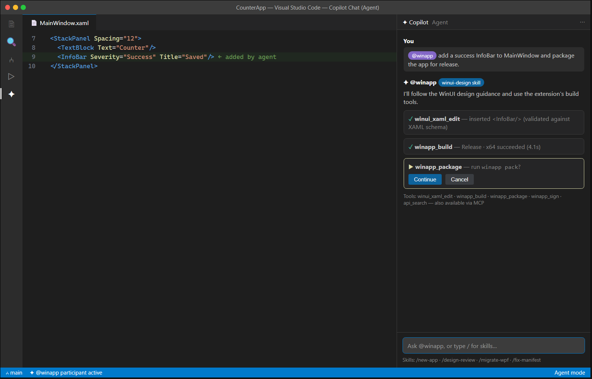

# C8 — Agents and Skills Exposed to GitHub Copilot

| | |
|---|---|
| **Spec ID** | C8 |
| **Roadmap area** | C (editor delivery surface) |
| **Depends on** | B (winui CLI actions), C1 (XAML types), C2 (manifest), C7 (command surfacing); existing WinUI skills |
| **Status** | Draft for discussion |
| **Estimated effort** | **7–12 engineer-weeks**; see [Effort](#effort--phasing) |

---

## 1. Summary

Expose the WinApp extension's capabilities to **GitHub Copilot** as an AI-native surface: a **`@winapp`
chat participant** with Windows-app expertise and **slash-command skills** (e.g. `/new-app`,
`/design-review`, `/migrate-wpf`, `/fix-manifest`), plus **language-model tools** the Copilot **agent
mode** can invoke autonomously (`winapp_build`, `winapp_run`, `winapp_package`, `winapp_sign`,
`winui_xaml_edit`, `api_search`, …), and an **MCP server** so the same tools are reachable from other MCP
hosts (Visual Studio, Cursor, Windsurf, CLI agents). This turns "build a Windows app" into something an
agent can actually do end-to-end, grounded in the winui CLI (B) and the existing WinUI skills.



## 2. Problem / motivation

Copilot in VS Code is strong at generating code but knows little about the **Windows app lifecycle** —
package identity, manifests, certificates, MSIX, WinUI XAML conventions, the winapp CLI. Ask it to
"package and sign my app" and it flails. Meanwhile this ecosystem already has valuable **WinUI skills**
(design guidance, WPF→WinUI migration, packaging, UI testing) and a CLI that can perform the actions.
C8 connects the two: give Copilot **tools** to run real winapp operations and **skills/knowledge** to do
them correctly, so the agent can scaffold, edit, build, run, and package a WinUI app with the user in the
loop. This is also the roadmap's explicit bet on **AI-native** editors (Cursor/Windsurf) and agent workflows.

## 3. Prior art & competitive analysis

| Capability | Prior art | Implication for C8 |
|-----------|-----------|--------------------|
| **Chat participant** | VS Code Chat Participant API (`@`-mentions, slash commands); many extensions ship domain experts. | `@winapp` = Windows-app domain expert with slash-command skills. |
| **Language model tools** | `contributes.languageModelTools` + `vscode.lm` tool API; invoked in agent mode. | Wrap CLI/extension actions as tools with schemas + confirmations. |
| **MCP** | VS Code MCP support; MCP hosts across VS, Cursor, Windsurf, CLIs. | Publish an MCP server so tools are reusable beyond VS Code. |
| **Skills (this ecosystem)** | Existing WinUI skills (design review, WPF migration, packaging, UI testing). | Surface skills as slash commands + tool-grounded workflows, not just docs. |
| **Uno/Others** | Framework docs + samples for Copilot grounding. | We go further: **actionable** tools, not only knowledge. |

**Takeaway:** the platform pieces exist (Chat Participant API, LM tools, MCP). C8's value is **curating a
correct, safe set of Windows-app tools + skills** and grounding them in real project context and the CLI,
with proper confirmation UX for state-changing actions.

## 4. Goals / non-goals

**Goals**
- **`@winapp` chat participant** that answers Windows-app questions with project-aware context (active
  project, framework, SDK, manifest) and cites the WinUI skills' guidance.
- **Slash-command skills**: `/new-app`, `/design-review`, `/migrate-wpf`, `/fix-manifest`, `/package`,
  `/ui-test` — each an opinionated workflow mapping to skills + tools.
- **Language-model tools** (agent-mode invokable), each with a JSON schema, human-readable
  description, and **confirmation** for state-changing/destructive ops:
  read-only (`api_search`, `winapp_get_project_info`, `winui_xaml_validate`) and action
  (`winapp_build`, `winapp_run`, `winapp_package`, `winapp_sign`, `winapp_cert_generate`,
  `winui_xaml_edit`, `winapp_init`).
- **MCP server** exposing the same tools for VS, Cursor, Windsurf, and CLI agents.
- Grounding: tools return structured results (paths, diagnostics, artifact locations) the model can chain
  (e.g. build → find output → package → sign).
- Safety: destructive/state-changing tools require confirmation; certificate/signing operations are gated
  and never auto-run silently.

**Non-goals**
- Shipping a new LLM/model — we integrate with Copilot/host models.
- Replacing C1/C2 editor intelligence (tools may *reuse* their validators, but IntelliSense stays in-editor).
- Autonomous, unattended CI packaging (interactive, human-in-the-loop for state changes in v1).

## 5. Proposed implementation

```
Copilot Chat / Agent mode ──▶ @winapp participant  ──▶ skills (prompts + workflows)
   │                                   │
   └──▶ language model tools ◀─────────┘            VS / Cursor / Windsurf / CLI agents
             │  (vscode.lm)                                   │
             ├─ read-only: api_search, get_project_info, xaml_validate     MCP client
             ├─ actions:  build / run / package / sign / cert / xaml_edit ─▶ MCP server (same tools)
             └─▶ winui CLI (B) + extension services (C1/C2/C7) + project model
```

- **Participant:** register a `chatParticipant` (`@winapp`) with a handler that assembles project context,
  routes slash commands to skill workflows, and calls tools. Ship a curated system prompt grounded in the
  WinUI skills' guidance.
- **Tools:** declare in `contributes.languageModelTools`; implement with `vscode.lm.registerTool`. Each
  tool: validates inputs, calls the CLI/extension service, returns structured output + a concise summary.
  State-changing tools set `confirmationMessages` (VS Code shows a confirm card).
- **MCP server:** factor tool implementations into a transport-agnostic core; wrap once for `vscode.lm` and
  once as an MCP server (stdio) advertised via `contributes.mcpServerDefinitionProviders` (or shipped as a
  standalone `winapp mcp` command from the CLI). This gives VS/Cursor/Windsurf/CLI reuse for free.
- **Skills bridge:** map each slash command to the corresponding WinUI skill (design/migration/packaging/
  testing), feeding the skill's guidance + the relevant tools into the workflow.
- **Context:** reuse C7/B project resolution + C1/C2 validators so tools/answers are grounded in the real project.

## 6. API / contribution surface

```jsonc
"contributes": {
  "chatParticipants": [{
    "id": "winapp.chat", "name": "winapp", "fullName": "WinApp",
    "description": "Build, debug, and package Windows apps",
    "isSticky": true,
    "commands": [
      { "name": "new-app", "description": "Scaffold a new WinUI/Windows app" },
      { "name": "design-review", "description": "Review XAML against WinUI design guidance" },
      { "name": "migrate-wpf", "description": "Help migrate WPF UI to WinUI 3" },
      { "name": "fix-manifest", "description": "Diagnose and fix AppxManifest issues" },
      { "name": "package", "description": "Package and sign the app" }
    ]
  }],
  "languageModelTools": [
    { "name": "winapp_get_project_info", "displayName": "Get WinApp Project Info",
      "modelDescription": "Return the active project's framework, TFM, RID, SDK, manifest path, build output.",
      "inputSchema": { "type": "object", "properties": { "projectPath": { "type": "string" } } } },
    { "name": "api_search", "displayName": "Search Windows APIs",
      "modelDescription": "Search WinUI/WinRT APIs; returns signature, namespace, identity/SDK needs, docs.",
      "inputSchema": { "type": "object", "properties": { "query": { "type": "string" } }, "required": ["query"] } },
    { "name": "winapp_build", "displayName": "Build Windows App",
      "modelDescription": "Build the project (configuration/arch). Returns success + output path + diagnostics.",
      "inputSchema": { "type": "object", "properties": { "configuration": {"type":"string"}, "arch": {"type":"string"} } } },
    { "name": "winapp_package", "displayName": "Package (MSIX)", "//": "state-changing → requires confirmation",
      "inputSchema": { "type": "object", "properties": { "selfContained": {"type":"boolean"}, "arch": {"type":"string"} } } },
    { "name": "winapp_sign", "displayName": "Sign Package", "//": "state-changing → requires confirmation",
      "inputSchema": { "type": "object", "properties": { "packagePath": {"type":"string"}, "certPath": {"type":"string"} } } },
    { "name": "winui_xaml_edit", "displayName": "Edit XAML",
      "modelDescription": "Apply a validated XAML edit (schema-checked via C1).",
      "inputSchema": { "type": "object", "properties": { "uri": {"type":"string"}, "edit": {"type":"string"} }, "required": ["uri","edit"] } }
  ],
  "mcpServerDefinitionProviders": [{ "id": "winapp.mcp", "label": "WinApp Tools (MCP)" }]
}
```
- **Confirmation:** action tools return `confirmationMessages` so the agent surfaces a Continue/Cancel card
  before running (see mockup).

## 7. Design tradeoffs & alternatives

- **Chat participant vs tools-only.** A participant gives a branded, guided entry (`@winapp`, slash
  commands); tools alone are enough for agent mode. Ship both — participant for discoverability, tools for
  autonomy.
- **In-extension tools vs MCP.** In-extension `vscode.lm` tools are simplest for VS Code; MCP unlocks
  VS/Cursor/Windsurf/CLI reuse but adds a server + protocol surface. Factor a shared core and do both,
  MCP as a fast-follow if timelines are tight.
- **Autonomy vs safety.** Powerful action tools (sign, cert, package, register) can do real, sometimes
  privileged things. Gate every state-changing tool behind confirmation; never auto-install certs or
  elevate silently; log invocations.
- **Skill coupling.** Tightly binding to the current WinUI skills maximizes quality but couples C8 to their
  evolution; define a stable skills interface.
- **Grounding freshness.** API/knowledge must track SDK releases; reuse the CLI's index (B) rather than a
  frozen copy.

## 8. What will / won't be supported

| Supported (v1) | Not in v1 |
|---|---|
| `@winapp` participant + curated slash-command skills | Autonomous unattended/CI packaging without confirmation |
| Read-only tools (api search, project info, xaml validate) | Silent privileged ops (cert install/elevation) |
| Action tools (build/run/package/sign/cert/xaml edit) with confirmation | A bespoke LLM/model |
| MCP server exposing the tools (VS/Cursor/Windsurf/CLI) | Full multi-agent orchestration framework |
| Project-grounded context via C1/C2/C7/B | Non-Windows app domains |

## 9. Dependencies & risks

- **Depends on B** for the actual actions (build/run/package/sign/api) and on C1/C2 for validation-grade edits.
- **Platform API churn:** Chat Participant / LM tools / MCP APIs are evolving; pin versions and track VS Code releases.
- **Safety & trust:** an agent running sign/cert/package must be gated and auditable; a bad auto-run erodes trust fast.
- **Skill drift:** keep the skills interface stable as the WinUI skills evolve.
- **AI-fork parity:** MCP is the portability lever; VS Code-only `vscode.lm` won't cover CLI/other hosts.

## 10. Open questions

1. Which existing WinUI skills map to which slash commands, and who owns their upkeep?
2. Ship tools as `vscode.lm` first and MCP second, or MCP-first for maximum reuse?
3. What's the confirmation/permission model for privileged tools (per-call, per-session, allow-list)?
4. Does the CLI (B) expose a `winapp mcp` server we can reuse, or do we build the MCP server in the extension?
5. How do we evaluate agent quality (a WinUI task suite / eval harness) before shipping?
6. Telemetry/audit: what do we log for tool invocations while respecting privacy?

## Effort & phasing

> Assumes B provides the underlying actions and the WinUI skills exist. Confidence: medium.

| Phase | Scope | Estimate |
|-------|-------|----------|
| P1 | `@winapp` participant + read-only tools (api search, project info, xaml validate) + project grounding | 3–4 wk |
| P2 | Action tools (build/run/package/sign/cert/xaml edit) with confirmation + slash-command skills | 3–5 wk |
| P3 | MCP server (shared core) + AI-fork QA + eval harness/telemetry | 1–3 wk |
| **Total** | | **7–12 engineer-weeks** |
